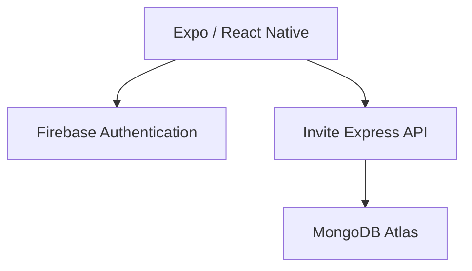
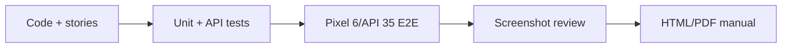

# Invite

<p align="center">
  
</p>

<p align="center"><strong>Small plans. Real connections.</strong><br />Turn shared interests into thoughtful local invitations.</p>

<p align="center">
  <a href="https://github.com/charifmahmoudi/Invite-someone-app/actions/workflows/ci.yml"></a>
  <a href="https://github.com/charifmahmoudi/Invite-someone-app/blob/main/LICENSE"></a>
  <a href="https://github.com/charifmahmoudi/Invite-someone-app"></a>
</p>

Invite is a cross-platform social activity app designed to make the first move easier. Members create a profile, discover people through shared interests, make a small plan, and send a thoughtful invitation. Repeated low-pressure interactions can grow into genuine local communities.

The same TypeScript codebase runs on iPhone, Android, and the web using Expo SDK 57 and React Native.

> **MVP acceptance status:** The application foundation and standard CI are working. Formal MVP acceptance is still in progress: Android emulator E2E, reviewed screenshot evidence, and all 13 verified user stories are required before release claims are made.

## Product at a glance

Invite is built around a simple loop:

1. Create a useful profile with interests, availability, and connection goals.
2. Discover compatible people using transparent, privacy-preserving signals.
3. Create a small activity or find a community plan.
4. Send a thoughtful invitation and decide without pressure.

The repository includes a demo mode for product review. Verified product screenshots will be added here only from successful Android emulator runs; generated or simulated UI images are not treated as acceptance evidence.

## Product highlights

- Guided account creation with interests, availability, and connection goals
- Personalized activity feed with category filters and saved plans
- Photo-backed people discovery with biography, interest, availability, goal, trust, and distance filters
- Privacy-first approximate-area map with no exact home pins or location permission
- Complete host flow: create an activity, set capacity and visibility, and invite recommended people
- Received and sent invitation inboxes with accept, decline, and cancel states
- Community activities that members can join, with transactional capacity protection in production
- Profile editing, attendance history, reliability signals, and hosted plans
- First-meeting safety guidance embedded in invitation and activity flows
- Local demo/internal-auth compatibility plus Firebase Authentication managed identity
- Server-side Express/MongoDB API for authorization and product data

## Quick start

Requirements:

- Node.js 22.13 or newer
- npm 10 or newer
- Android Studio for a local Android build, or Xcode 26.4+ on macOS for iOS

Install and verify:

```bash
npm ci
npm run typecheck
npm test
npm run lint
```

Start Expo:

```bash
npm start
```

You can also run the web target with `npm run web`. SDK 57 should be tested with an Expo development build rather than the store version of Expo Go:

```bash
npx expo run:android
npx expo run:ios
```

The iOS command requires macOS. EAS profiles for cloud development, preview, and production builds are included in [eas.json](./eas.json).

## Installable builds and Google Play

Changes to `main` continue to use the compatibility mobile-preview path. Firebase migration/release testing happens on `impl/firebase-auth`.

The [Validate Firebase Android workflow](./.github/workflows/validate-firebase-android.yml) validates the isolated Firebase API, generates the Android native project, builds a staging APK, verifies its certificate, builds a protected upload-key-signed AAB, authenticates to Google Cloud through Workload Identity Federation, and publishes the bundle to Google Play Internal testing.

Current Play staging state:

```text
Package: com.charifmahmoudi.invite
Track: internal
Release: Invite Internal 15
Android versionCode: 5
```

Google Play tester enrollment, release visibility, physical-device installation, and launch are working. The Play-delivered build installs and runs on the test phone.

The release owner has explicitly **waived the full Play-installed functional acceptance suite for this release candidate**. That suite is therefore **skipped, not passed**; its unexecuted checks must not be represented as verified. See [Current status](./docs/CURRENT_STATUS.md) for the exact waived checks and remaining production-readiness steps.

The [Play Store Screenshots workflow](./.github/workflows/play-store-screenshots.yml) boots a hardware-accelerated Android emulator, installs the verified staging APK, captures real Invite screens, publishes them to the Play listing, and verifies the listing contains at least two phone screenshots.

See [Current status](./docs/CURRENT_STATUS.md), [Deployment architecture](./docs/DEPLOYMENT_ARCHITECTURE.md), and [Google Play testing](./docs/GOOGLE_PLAY_TESTING.md) before changing signing, versionCode, testers, or production infrastructure.

## Try the complete demo

No backend is required for product review. On the welcome screen, choose **Explore the demo**. Demo changes are persisted on the device with AsyncStorage.

You can also use the local compatibility sign-in screen:

- Email: `demo@invite.app`
- Password: any non-empty value in local preview mode

## Architecture

Invite deliberately separates identity from product data:



Firebase is an identity provider only. MongoDB remains authoritative for profiles, activities, invitations, saved plans and identity mappings.

The Express API maps each Firebase UID to an internal Invite user ID, so authentication-provider IDs do not leak throughout the domain model.

The client never connects directly to MongoDB. Firebase owns identity; the Invite API owns authorization and business rules; MongoDB owns profiles, activities, invitations, saved plans, and identity mappings.

Current deployment separation:

```text
Firebase staging
  impl/firebase-auth
  -> Render invite-someone-api-firebase-e2e
  -> MongoDB invite_firebase_e2e
  -> Google Play Internal testing

Production (not cut over)
  main
  -> Render invite-someone-api
  -> MongoDB invite_someone
  -> compatibility/internal auth until explicit production cutover
```

Render auto-deploy is disabled for staging and production. Git branch HEAD and live Render deployment revision must be checked independently.

See [Deployment architecture](./docs/DEPLOYMENT_ARCHITECTURE.md) for the complete environment, CI/CD, signing, secret-boundary, promotion and rollback model.

## Quality and delivery model



Every user story is traced through implementation references, automated tests, a Maestro flow, screenshot checkpoints, and a user-manual section. A story is not `verified` merely because code exists or CI passes: the required emulator screenshots must come from the same successful run and be visually reviewed for correctness, readability, privacy, and provenance.

See the [MVP delivery standard](./docs/MVP_DELIVERY.md), [user stories](./docs/USER_STORIES.md), [testing strategy](./docs/TESTING.md), and [current status](./docs/CURRENT_STATUS.md).

## Connect MongoDB and the API

Invite uses the Express/MongoDB API whenever `EXPO_PUBLIC_API_URL` is set. The phone never connects directly to MongoDB: APK and IPA files can be inspected, so embedding a database username/password would expose the database.

For compatibility/internal auth, see [MongoDB backend setup](./docs/MONGODB_BACKEND.md). For the managed-auth configuration, set the API to `AUTH_MODE=firebase` and follow [FIREBASE_AUTH_SETUP.md](./docs/FIREBASE_AUTH_SETUP.md).

The API protects every mutation with server authorization, removes private auth/email fields from public profile responses, uses coarse geospatial discovery, and performs invitation acceptance plus attendance in a MongoDB transaction.

## Managed-auth client variables

A Firebase-enabled build uses public Firebase Web configuration:

```bash
EXPO_PUBLIC_API_URL=https://your-invite-api.example
EXPO_PUBLIC_FIREBASE_API_KEY=your_web_api_key
EXPO_PUBLIC_FIREBASE_AUTH_DOMAIN=your-project.firebaseapp.com
EXPO_PUBLIC_FIREBASE_PROJECT_ID=your-project
EXPO_PUBLIC_FIREBASE_STORAGE_BUCKET=your-project.firebasestorage.app
EXPO_PUBLIC_FIREBASE_MESSAGING_SENDER_ID=123456789
EXPO_PUBLIC_FIREBASE_APP_ID=1:123456789:web:example
```

Android Google sign-in is configured natively with `google-services.json`, a Web OAuth client for ID-token issuance, and a Google OAuth **Android** client registered for `com.charifmahmoudi.invite` plus the certificate SHA-1 used to sign the installed build. Android does not require an OAuth client secret or `EXPO_PUBLIC_GOOGLE_*` variables.

Every Android signing channel can have a different SHA-1. The direct staging APK, Play upload key, and Play App Signing certificate are separate identities. A Google Play-installed build uses the **Play App Signing** certificate for Google OAuth matching.

Never put MongoDB credentials, OAuth client secrets, Firebase service-account JSON, signing private keys, or private keys in `EXPO_PUBLIC_*` variables.

## Commands

| Command                  | Purpose                                           |
| ------------------------ | ------------------------------------------------- |
| `npm start`              | Start Expo development server                     |
| `npm run android`        | Open the Android target                           |
| `npm run ios`            | Open the iOS target                               |
| `npm run web`            | Open the web target                               |
| `npm run typecheck`      | Run strict TypeScript checks                      |
| `npm run lint`           | Run Expo's ESLint rules and React Compiler checks |
| `npm test`               | Run the Jest user-story suite                     |
| `npm run test:ci`        | Run tests with coverage in CI mode                |
| `npm run export:web`     | Produce a static web export                       |
| `npm run server:dev`     | Start the MongoDB API with file watching          |
| `npm run server:start`   | Start the MongoDB API                             |
| `npm run server:indexes` | Create/verify MongoDB indexes                     |
| `npm run server:seed`    | Seed an empty database with fictional demo data   |
| `npm run format`         | Format source and documentation                   |

## Documentation

Product: [brief](./docs/PRODUCT.md) · [feature catalogue](./docs/FEATURES.md) · [user stories](./docs/USER_STORIES.md)

Development: [architecture](./docs/ARCHITECTURE.md) · [data model](./docs/DATA_MODEL.md) · [MongoDB/API setup](./docs/MONGODB_BACKEND.md) · [contributing](./CONTRIBUTING.md)

Quality: [testing strategy](./docs/TESTING.md) · [MVP delivery standard](./docs/MVP_DELIVERY.md) · [E2E fixtures](./docs/E2E_FIXTURES.md) · [user manual](./docs/USER_MANUAL.md)

Operations: [current status](./docs/CURRENT_STATUS.md) · [deployment architecture](./docs/DEPLOYMENT_ARCHITECTURE.md) · [Firebase setup](./docs/FIREBASE_AUTH_SETUP.md) · [Firebase runbook](./docs/FIREBASE_OPERATIONS_RUNBOOK.md) · [Google Play guide](./docs/GOOGLE_PLAY_TESTING.md)

Trust and safety: [safety and privacy](./docs/SAFETY_AND_PRIVACY.md)

## Project status

This repository contains a functional, testable MVP foundation. Firebase Authentication is staged on `impl/firebase-auth`; Google Play Internal testing is configured; and the Play-delivered build installs/runs on the test phone. Formal acceptance remains gated by the Android E2E suite, screenshot review, and verification of all 13 stories. The full Play-installed functional acceptance suite has been explicitly waived for this release candidate and remains unverified rather than passed. Production `main`, the production Render service, and production MongoDB remain unchanged pending explicit production promotion/cutover actions.

See [CURRENT_STATUS.md](./docs/CURRENT_STATUS.md) for the exact completed work, waiver, and remaining release gates.

Push notifications, chat, moderation operations, first-party image uploads, localization, analytics, Apple sign-in, explicit legacy-account linking, and app-store production credentials/promotion remain later work.

## License

MIT © 2026 Charif Mahmoudi. See [LICENSE](./LICENSE).
