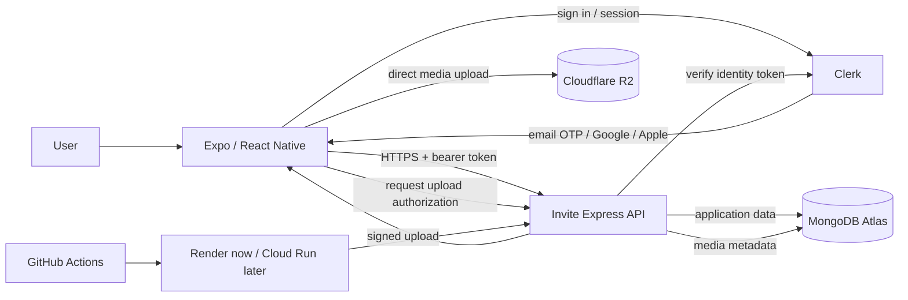
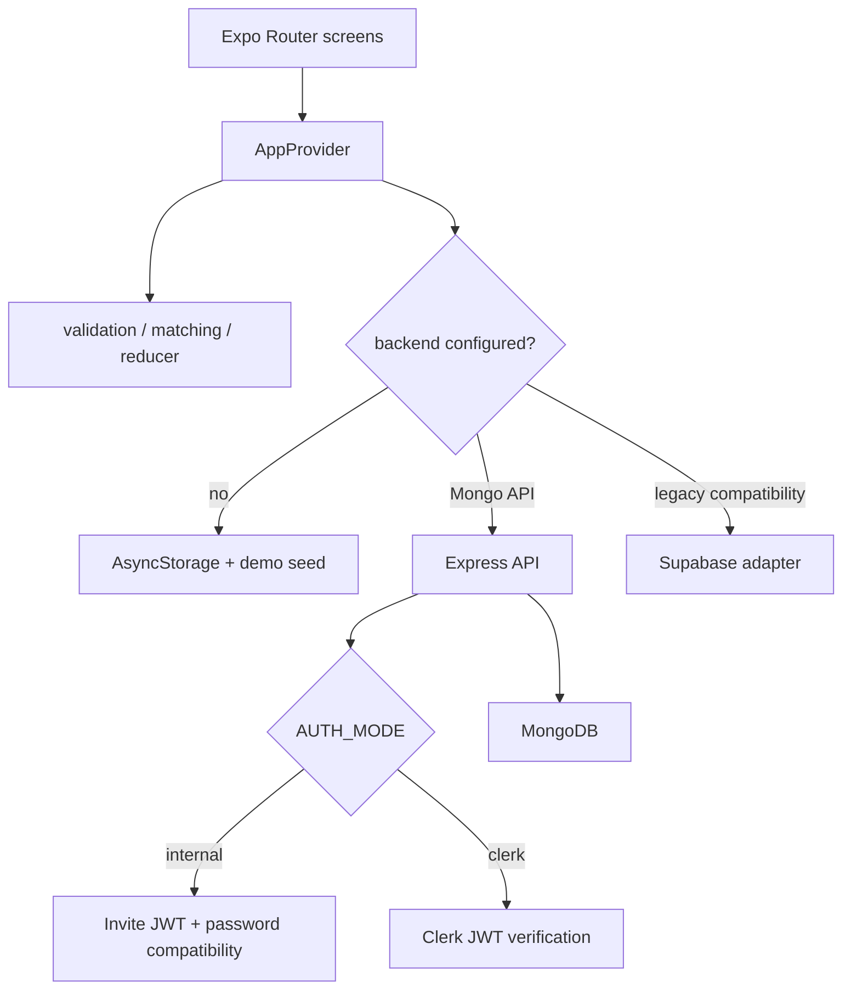
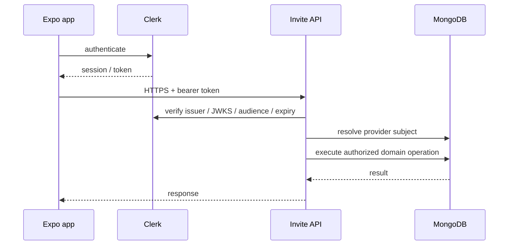
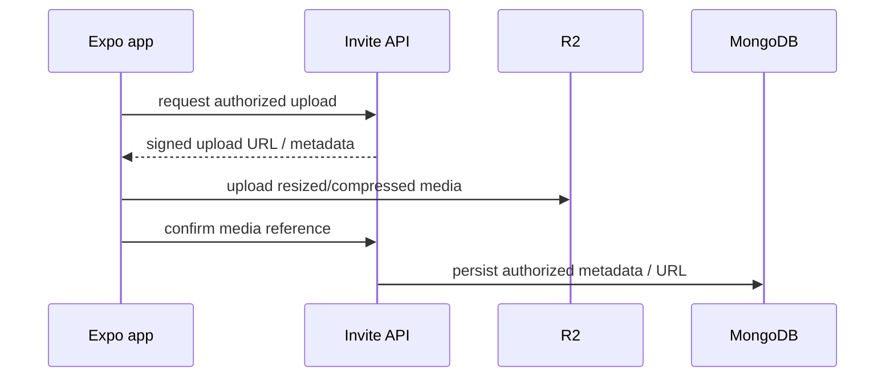

# Architecture

## Purpose

Invite is a cross-platform social activity application built with Expo and React Native. This document describes both the architecture that is running today and the target architecture being introduced incrementally.

The guiding rule is that Invite owns its product domain—activities, invitations, visibility, capacity, trust and moderation—while commodity infrastructure such as authentication and object storage stays behind explicit boundaries.

## Architecture principles

1. **Thin client.** Screens render state and call typed commands; they do not query MongoDB directly.
2. **Authoritative API.** Authentication proves identity; the Invite API owns authorization and business rules.
3. **Stateless compute.** API processes may stop or be replaced without losing domain state.
4. **Provider-neutral identity.** External identity-provider subjects do not become IDs throughout Invite domain records.
5. **Managed persistence.** MongoDB stores application records; object storage will store uploaded media.
6. **Scale-to-zero friendly.** Startup is lightweight, Mongo pools are small, reads become paginated, and background services are avoided until needed.
7. **Portable deployment.** The API is standard Node/Express and has a Docker image so the same application can run on Render, Cloud Run or another container host.
8. **Real trust-boundary tests.** E2E tests authenticate through the configured identity system instead of enabling an Invite authentication bypass.

## Target architecture



### Responsibilities

| Component | Owns | Does not own |
| --- | --- | --- |
| Expo / React Native | UI, navigation, local presentation state, non-sensitive cache | authorization, database credentials, server secrets |
| Clerk | authentication, email/social sign-in, sessions, identity tokens | activities, invitations, reputation, moderation rules |
| Invite API | token verification, authorization, validation, domain rules, orchestration | durable session state, media bytes |
| MongoDB Atlas | Invite users, identity mappings, profiles, activities, invitations, saved data, future moderation data | first-party authentication passwords after Clerk migration |
| Cloudflare R2 | uploaded media | Invite domain records |
| GitHub Actions | quality gates, native builds, E2E orchestration | secrets embedded into app binaries |
| Render / Cloud Run | stateless API compute | durable application data |

## Implementation status

### Implemented now

- Express API remains the authoritative domain boundary.
- MongoDB connection creation is lazy and no longer performs index maintenance during every cold start.
- MongoDB defaults to a small autoscaling-friendly pool (`maxPoolSize=5`, `minPoolSize=0`, idle timeout configurable).
- Database indexes are maintained explicitly with `npm run server:indexes`; seeding also ensures indexes.
- API startup no longer waits for a MongoDB ping before listening.
- A portable `Dockerfile` and `.dockerignore` exist.
- Authentication is behind a provider-neutral server boundary with two modes:
  - `internal` compatibility mode for the current deployed client;
  - `clerk` mode using issuer/JWKS verification and an internal identity mapping collection.
- MongoDB contains a `user_identities` collection contract with a unique `(provider, providerSubject)` mapping to an Invite user ID.
- New resource-oriented paginated reads exist alongside the compatibility `/v1/data` endpoint:
  - `GET /v1/me`
  - `GET /v1/activities?limit=&cursor=`
  - `GET /v1/people?limit=&cursor=`
  - `GET /v1/invitations?direction=&limit=&cursor=`
  - `GET /v1/saved?limit=&cursor=`
- The client data adapter exposes page helpers for those endpoints while the existing `AppProvider` may continue using `/v1/data` during migration.
- Stable UI selectors and a manual Android/Maestro E2E smoke workflow exist.

### Configuration still required

The following cannot be made operational without external account configuration:

- Clerk development and production instances;
- Clerk publishable key in Expo builds;
- Clerk issuer/JWKS/audience configuration in the API;
- an isolated E2E API/database environment;
- Cloudflare R2 account/bucket and signing credentials when first-party image upload is implemented;
- Google and Apple provider configuration.

Until Clerk is configured, production remains on `AUTH_MODE=internal`. That compatibility path is deliberate so architecture work can land without breaking the current Render deployment.

## Current runtime paths



The Supabase adapter is compatibility code and is not part of the target production architecture.

## Authentication and authorization

Authentication answers **who the caller is**. Authorization answers **what that caller may do in Invite**.

The target authentication methods are:

1. email one-time code;
2. Google;
3. Apple when iOS production configuration is available.

The Invite API continues to enforce rules such as:

- only an activity host can send invitations;
- only the invitation receiver can accept or decline;
- only the sender can cancel a pending invitation;
- invite-only activities stay hidden from unrelated users;
- a member can update only their own profile;
- final-slot capacity is enforced atomically on the server.

### Internal identity mapping

The external authentication subject is mapped to a stable Invite user ID.

```text
user_identities
  _id
  userId
  provider            # clerk
  providerSubject     # Clerk token sub
  email
  emailVerified
  createdAt
  updatedAt
```

Domain records continue referencing Invite IDs:

```text
activity.hostId       -> Invite user ID
invitation.senderId   -> Invite user ID
invitation.receiverId -> Invite user ID
saved.userId          -> Invite user ID
```

This keeps Clerk replaceable and supports future identity linking without rewriting every domain record.

### Request flow in Clerk mode



The server may use `CLERK_SECRET_KEY` for server-only identity operations when needed. It must never be compiled into the Expo app.

## API design

### Stateless requests

A normal API request follows:

```text
request
  -> verify identity
  -> resolve Invite user
  -> validate input
  -> authorize domain operation
  -> query/update MongoDB
  -> return response
```

No important user or domain state exists only in process memory.

### Resource-oriented reads

The original `/v1/data` endpoint remains temporarily for binary compatibility. New code should migrate screen-by-screen toward smaller endpoints.

All list endpoints use a bounded page size (default 20, maximum 50) and opaque cursor pagination. The cursor is an API implementation detail and clients must treat it as opaque.

This reduces MongoDB reads, JSON serialization, API memory and network transfer as data grows.

### Writes and concurrency

The existing atomic capacity and invitation-acceptance transaction remain authoritative. They must not be simplified merely to reduce hosting cost.

For invitation acceptance:

1. authenticate and resolve the Invite user;
2. verify the caller is the invitation receiver;
3. begin a MongoDB transaction;
4. atomically add the receiver only if capacity remains;
5. mark the invitation accepted;
6. commit both state changes together;
7. update client state only after server success.

Automatic retries for writes require idempotency semantics first.

## MongoDB architecture

### Connection strategy

The connection client is shared within a process and configured for small autoscaling instances. Default settings are intentionally conservative:

```text
maxPoolSize = 5
minPoolSize = 0
maxIdleTimeMS = 30000
```

These are starting values, not immutable production tuning. Measure actual latency and connection pressure before increasing them.

### Startup versus maintenance

```text
API startup
  -> load configuration
  -> start HTTP server
  -> establish MongoDB access lazily on first database request

maintenance
  -> npm run server:indexes
  -> npm run server:seed
```

A cold-started container does not reseed data or recreate indexes.

### Index lifecycle

`npm run server:indexes` creates/verifies the expected indexes. Run it when provisioning an environment or after adding/changing an index definition. `server:seed` also calls the index command before inserting development data.

## Media architecture

Cloudflare R2 is a planned component, not yet an active dependency.

When uploads are introduced, the intended flow is direct-to-object-storage:



The API should not proxy multi-megabyte image bodies unless there is a specific security requirement that cannot be achieved with signed uploads.

## Client state and caching

- authentication/session material belongs in the identity SDK's secure native storage path;
- AsyncStorage may cache non-sensitive application data;
- cached reads may render immediately and revalidate in the background;
- the API remains authoritative for writes;
- production mutations are not blindly queued offline;
- client permission checks improve UX but never replace server authorization.

The current global `AppProvider` is acceptable for the MVP. As server-state pagination and invalidation expand, migrate those reads to a server-state cache such as TanStack Query rather than making the context a permanent data layer.

## Deployment architecture

### Today

```text
Expo app -> Render free API -> MongoDB Atlas
```

Render is acceptable for development, demos and private beta. The client must tolerate cold starts on read requests.

### Portable target

```text
GitHub -> CI -> Docker image -> Render or Cloud Run
```

The `Dockerfile` is intentionally provider-neutral. The application does not require a persistent local filesystem.

Cloud Run is an optional later deployment target. If used for an MVP, start with zero minimum instances and a deliberately small maximum instance count to control cost.

## Environment separation

| Environment | Identity | API | MongoDB | Purpose |
| --- | --- | --- | --- | --- |
| development | Clerk development after migration | local/dev | local/dev | developer iteration |
| E2E | Clerk development/test after migration | isolated E2E | isolated E2E | deterministic emulator tests |
| production | Clerk production | production | production | real users |

An E2E emulator must never run against production identity plus production data.

## Repository direction

```text
src/
  app/                  routes/screens
  components/           reusable UI
  data/                 API/cache adapters
  domain/               pure business rules
  state/                application orchestration
  types/                domain contracts
  __tests__/            unit/domain tests

server/src/
  auth.ts               provider-neutral authentication boundary
  config.ts             runtime configuration
  database.ts           Mongo connection and collection contracts
  resource-router.ts    paginated read API
  app.ts                compatibility routes + domain mutations
  indexes.ts            explicit index maintenance
  seed.ts               development/test seed

docs/
  ARCHITECTURE.md
  TESTING.md
```

`server/src/app.ts` and `src/state/app-context.tsx` are still large orchestration files. Split them by domain as the migration proceeds rather than introducing microservices.

## Non-goals

The current stage does not require:

- Kubernetes;
- microservices;
- Kafka;
- mandatory Redis;
- a separate worker before real background workloads exist;
- persistent WebSocket infrastructure before realtime features exist;
- a custom password/authentication platform.

A single stateless API, one application database, one identity provider and object storage are sufficient for the foreseeable MVP/private-beta stage.

## Migration sequence

1. **Implemented:** document architecture and E2E trust boundaries.
2. **Implemented:** Dockerize the API.
3. **Implemented:** separate cold start from index/seed maintenance.
4. **Implemented:** tune MongoDB connection pooling for small autoscaling instances.
5. **Implemented foundation:** add paginated resource endpoints while preserving `/v1/data` compatibility.
6. **Implemented foundation:** introduce provider-neutral authentication and Clerk JWT verification mode.
7. **Next, requires Clerk configuration:** add Expo Clerk provider, email OTP/Google UI and identity provisioning/linking.
8. **Then:** migrate screens from bootstrap state toward paginated reads/cache.
9. **Then:** remove Invite password hashes/JWT issuance after Clerk migration is proven.
10. **Then:** add R2 direct uploads when first-party media upload ships.
11. **Then:** move the same container from Render to Cloud Run only if operationally useful.

See [TESTING.md](./TESTING.md) for validation and E2E requirements.
