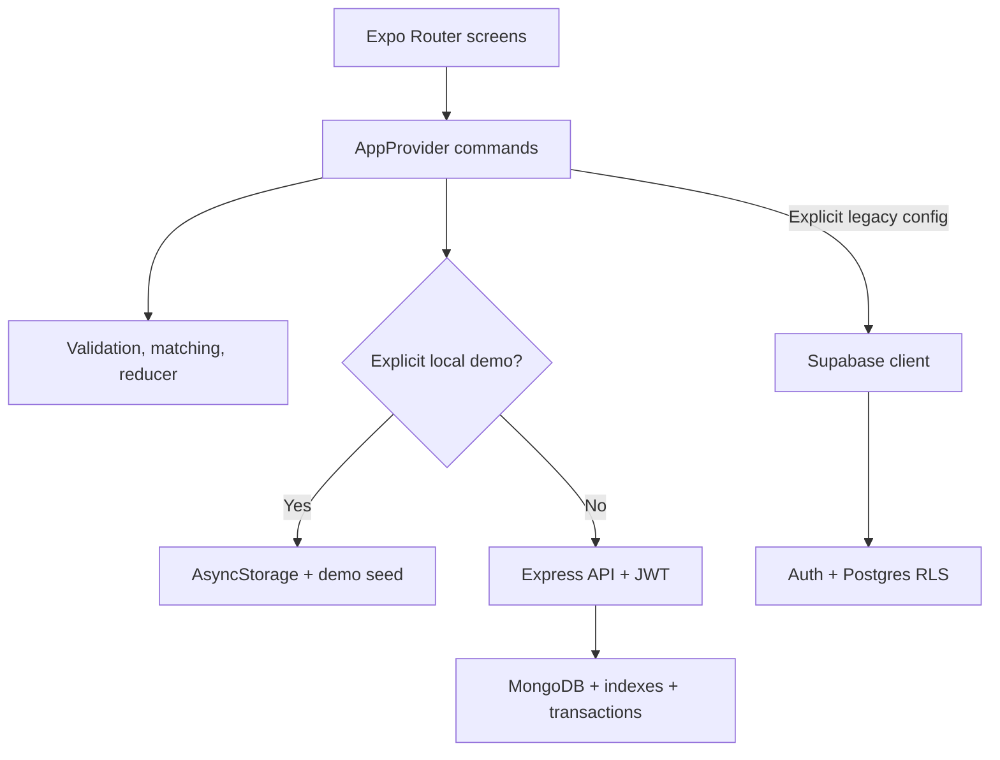

# Architecture

## Overview

Invite is a universal Expo Router application. Route components compose reusable UI, call a single typed application context, and never issue database queries directly. Core recommendation, validation, and state-transition rules are pure functions so they can be tested without a device or backend.



## Technology choices

| Concern                | Choice                                                   | Rationale                                                                      |
| ---------------------- | -------------------------------------------------------- | ------------------------------------------------------------------------------ |
| Cross-platform runtime | Expo SDK 57 / React Native 0.86                          | One native codebase, current Android/iOS targets, development builds, EAS path |
| Navigation             | Expo Router                                              | Typed file routes, native stacks/tabs, deep-link foundation                    |
| Language               | TypeScript in strict mode                                | Safer domain transitions and refactoring                                       |
| State                  | React context + pure reducer                             | Small MVP surface, dependency-light, directly testable transitions             |
| Local persistence      | AsyncStorage                                             | Fast demo/review loop without pretending to be secure authentication           |
| Validation             | Zod                                                      | Shared runtime validation with useful user-facing messages                     |
| Production backend     | Express API + MongoDB Node driver                        | Server-only credentials, portable deployment, atomic updates and transactions  |
| Session storage        | Expo SecureStore on Android/iOS                          | Keystore/Keychain protection for API bearer tokens                             |
| Tests                  | Jest / jest-expo                                         | Expo-aligned unit tests with story traceability                                |
| UI                     | Native primitives, Expo Symbols, LinearGradient, Haptics | Consistent native behavior with a small dependency surface                     |
| Maps                   | MapLibre Native/Web + OpenFreeMap                        | Interactive cross-platform maps without proprietary keys; attribution retained |

## Runtime modes

### Local preview mode

Local preview mode is disabled by default. A developer must explicitly set `EXPO_PUBLIC_ENABLE_LOCAL_DEMO=true` without an API override to load the seed snapshot. A user can then open the local demo or create a local preview profile. State changes are serialized to one versioned AsyncStorage key. Passwords are never persisted or validated in this mode.

This mode is for product review, automated UI work, and offline development—not real accounts.

### Production backend mode

The app defaults to the deployed Render API; `EXPO_PUBLIC_API_URL` overrides it for staging or local servers. It authenticates against Express and stores the signed session token in Expo SecureStore on native devices. The API owns MongoDB credentials, returns only authorized data, and validates every mutation. Authentication returns bootstrap data atomically, and other commands write remotely before dispatching locally. The existing Supabase adapter remains only as a compatibility path for explicitly reconfigured development builds.

## Command flow

For a representative invitation acceptance:

1. The screen calls `respondToInvitation(invitationId, 'accepted')`.
2. `AppProvider` validates that the invitation exists and sends the status update.
3. JWT middleware authenticates the caller and the API verifies that the caller is the receiver.
4. A MongoDB transaction atomically adds the receiver to the activity and marks the invitation accepted.
5. The activity update uses a capacity expression so concurrent final-slot attempts cannot overbook.
6. Only after database success does the reducer mark the invitation accepted and add the attendee locally.

Local preview mode executes the same reducer transition without the remote steps.

## Directory map

```text
src/
  app/                 Route groups and screens
    (auth)/            Welcome, sign-in, registration
    (tabs)/            Plans, people, invitations, profile
    activity/          Activity details
    invite/            Invitee recommendation and selection
    person/            Public member profile
    profile/           Profile editing
  components/          Reusable product and UI primitives
  constants/           Design tokens
  data/                Seed, persistence, Mongo API and Supabase adapters
  domain/              Pure reducer, validation, matching
  state/               AppProvider and commands
  types/               Domain contracts
  utils/               Formatting and client ID helpers
  __tests__/           Story-mapped automated tests
supabase/migrations/   Production schema, triggers, and policies
server/src/            Express API, authentication, MongoDB access, seed command
docs/                  Product and engineering decisions
```

## State ownership

`AppState` contains profiles, activities, invitations, saved IDs, session metadata, and transient hydration/busy/error flags. Screens derive views with `useMemo` where useful; they do not maintain duplicate server entities.

The reducer protects client invariants such as unique attendee IDs. Database constraints remain authoritative in production because client checks cannot defend against concurrency or a modified client.

## Recommendation model

The current score is deliberately explainable:

- activity-category interest: 45 points;
- each shared host interest: 8 points, capped at 24;
- same city: 18 points;
- reliability of 95% or higher: 8 points.

Host, attendee, and already-invited profiles are excluded. This is a deterministic MVP heuristic, not machine learning. Any later ranking model should preserve explanations, fairness monitoring, user controls, and an unranked discovery option.

## Error and offline behavior

- Corrupt local state falls back to seed data rather than blocking launch.
- Connected builds never hydrate seed data or expose a credential-free demo route.
- Remote mutations dispatch an error and leave the previous entity state intact.
- The MVP does not queue production mutations offline. Adding an operation log requires conflict semantics per command; blind last-write-wins is not appropriate for invitations or capacity.
- Mongo API tokens persist in encrypted platform storage. Authorization lives in API route checks and database filters, not in local route guards.

## Extension points

- Add generated Supabase database types and pass them to `createClient`.
- Move command orchestration from context into explicit repository classes if offline sync grows.
- Add TanStack Query when read invalidation, pagination, and background refresh justify it.
- Add server-side push notification fan-out from database webhooks or Edge Functions.
- Add moderation tables and admin-only workflows before public growth.
- Add a transactional “leave/cancel activity” function with reliability effects once attendance semantics are defined.
