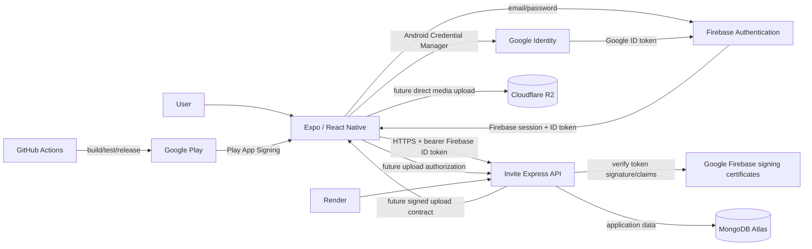
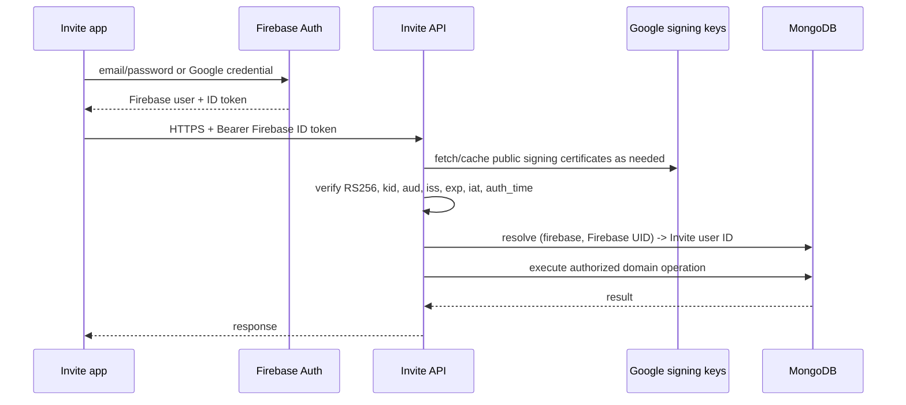
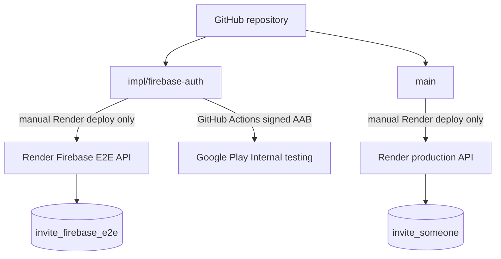

# Architecture

_Last verified: 2026-09-08._

## Purpose

Invite is a cross-platform social activity application built with Expo and React Native. Invite owns its product domain—profiles, activities, invitations, visibility, capacity, trust and moderation—while commodity identity and hosting remain behind explicit boundaries.

Current target stack:

- Expo / React Native client;
- Firebase Authentication for identity and sessions;
- native Android Google Sign-In through Credential Manager;
- stateless Express API for authorization and business rules;
- MongoDB Atlas for application/domain data;
- Render for current API compute, with a portable Docker path for a future Cloud Run migration;
- Google Play for Android test/production distribution;
- Cloudflare R2 later for first-party media.

Firebase is an identity provider only. It does not replace MongoDB as the Invite application database.

For environment topology, CI/CD, Render services and production-cutover details, see [DEPLOYMENT_ARCHITECTURE.md](./DEPLOYMENT_ARCHITECTURE.md).

## Architecture principles

1. **Thin client.** Screens render state and call typed commands; they do not connect directly to MongoDB.
2. **Authoritative API.** Firebase proves identity; the Invite API owns authorization and business rules.
3. **Stateless compute.** API processes may stop or be replaced without losing domain state.
4. **Provider-neutral identity.** Firebase UIDs never become IDs throughout Invite domain records.
5. **Managed persistence.** MongoDB stores application records; object storage will store uploaded media later.
6. **Scale-to-zero friendly.** Startup is lightweight, Mongo pools are small, reads are paginated, and background services are avoided until needed.
7. **Portable deployment.** The API is normal Node/Express and can run directly or from the checked-in Docker image.
8. **Real trust-boundary tests.** Hosted validation uses genuine Firebase-issued tokens rather than an Invite authentication bypass.
9. **Release isolation.** Firebase staging, Play Internal testing and production are separate gates; a successful build does not imply production promotion.

## Target architecture



### Responsibilities

| Component | Owns | Does not own |
| --- | --- | --- |
| Expo / React Native | UI, navigation, Firebase client session, local presentation/cache | authorization, database credentials, server secrets |
| Firebase Authentication | email/password, email verification, password reset, Google identity exchange, Firebase UID/session | Invite profiles, activities, invitations, Invite authorization |
| Android Credential Manager / Google | native Google account selection and Google ID token issuance | Invite authorization or domain data |
| Invite API | Firebase token validation, internal-user resolution, authorization, validation, domain rules | Firebase passwords, durable session state, media bytes |
| MongoDB Atlas | Invite users, identity mappings, profiles, activities, invitations, saved data, future moderation data | managed authentication sessions |
| Google Play | Android test/production distribution and Play App Signing | Invite domain data or API authorization |
| GitHub Actions | quality gates, native builds, E2E orchestration, Play release automation | secrets embedded into app binaries |
| Render | stateless API compute | durable application data |
| Cloudflare R2 | future uploaded media | Invite domain records |

## Authentication modes

The API intentionally keeps two runtime modes during migration:

```text
AUTH_MODE=internal   # compatibility for existing binaries
AUTH_MODE=firebase   # target managed identity mode
```

A Firebase-enabled client activates only when `EXPO_PUBLIC_API_URL` and complete Firebase public client configuration are present. This prevents the default compatibility preview from sending Firebase tokens to an internal-auth API.

Production remains on compatibility/internal auth until the Play-delivered Firebase client passes acceptance and a compatible production-client rollout exists.

## Firebase request flow



The server validates Firebase ID tokens without a Firebase Admin service-account key. It pins `aud` to `invite-someone-app`, pins the issuer to `https://securetoken.google.com/invite-someone-app`, and caches Google's public certificates according to their cache headers.

## Internal identity mapping

MongoDB stores a stable mapping:

```text
user_identities
  _id
  userId
  provider            # firebase
  providerSubject     # Firebase UID
  email
  emailVerified
  createdAt
  updatedAt
```

Domain records continue referencing Invite IDs:

```text
activity.hostId       -> Invite user ID
invitation.senderId   -> Invite user ID
invitation.receiverId -> Invite user ID
saved.userId          -> Invite user ID
```

Historical provider values may remain in old isolated/test data, but the target managed provider is `firebase`.

## Registration, verification and provisioning

Email registration uses Firebase email/password. Firebase sends verification and password-reset email; Invite never stores or sees the Firebase password.

A successfully authenticated Firebase identity is not automatically an Invite member. Provisioning requires a verified email:

1. Firebase authenticates the user.
2. Email/password users verify their email; Google identities normally arrive with a verified email claim.
3. Invite asks for display name, city, interests, availability and connection goals.
4. The API validates the Firebase ID token again.
5. The API checks for an existing `(firebase, uid)` mapping.
6. If an existing Invite member already uses the email but no Firebase mapping exists, the API returns `ACCOUNT_LINK_REQUIRED`.
7. Otherwise, the API creates the Invite member and identity mapping transactionally.

Email equality alone is never used as proof for legacy account migration. A future linking flow must require recent proof of control of both identities.

## Authorization

Authentication answers **who the caller is**. The Invite API still decides **what that caller may do**.

Examples of server-enforced rules:

- only an activity host can send invitations;
- only the receiver can accept or decline an invitation;
- only the sender can cancel a pending invitation;
- invite-only activities stay hidden from unrelated users;
- a member can update only their own profile;
- final-slot capacity is enforced atomically;
- invitation acceptance and attendee insertion commit together in a MongoDB transaction.

Client permission checks improve UX but never replace these server rules.

## API and MongoDB

Resource-oriented reads coexist temporarily with compatibility `/v1/data`:

- `GET /v1/me`
- `GET /v1/activities?limit=&cursor=`
- `GET /v1/people?limit=&cursor=`
- `GET /v1/invitations?direction=&limit=&cursor=`
- `GET /v1/saved?limit=&cursor=`

Default MongoDB pool settings remain scale-to-zero friendly:

```text
maxPoolSize = 5
minPoolSize = 0
maxIdleTimeMS = 30000
```

Startup does not seed data or rebuild indexes during normal operation. Maintenance is explicit:

```bash
npm run server:indexes
npm run server:seed
```

`MONGODB_ENSURE_INDEXES_ON_START=true` is reserved for controlled bootstrap work and should return to `false` afterward.

## Client session and state

- Firebase Auth persistence uses AsyncStorage on React Native.
- The Firebase bridge listens for ID-token changes.
- `user.getIdToken()` feeds the existing Invite API token-provider abstraction, allowing Firebase to refresh tokens normally.
- Invite domain data is reloaded after identity/provisioning changes.
- Signing out of Invite also signs out of Firebase and the native Google session.
- A historical direct-Supabase data adapter remains as compatibility code when the Mongo API is not configured; it is not the target auth or production-data architecture.

## Google Sign-In

Android Google Sign-In uses `react-native-nitro-google-signin` and Android Credential Manager. The native library obtains a Google ID token, and Invite exchanges it for a Firebase credential with `GoogleAuthProvider.credential()` plus `signInWithCredential()`.

Android configuration requires:

- `google-services.json` for package `com.charifmahmoudi.invite`;
- a Google OAuth Android client for the package plus the certificate SHA-1 used by the installed build;
- the Web OAuth client generated/configured for Firebase ID-token issuance.

No OAuth client secret belongs in the mobile app, and no `EXPO_PUBLIC_GOOGLE_*` variables are required for the Android flow.

Different channels use different certificates. The repository/test APK, Play upload key and Play App Signing key must be treated as separate identities. The **Play App Signing SHA-1** is the one that matters for Google Sign-In in a build installed from Google Play.

iOS Google Sign-In remains disabled until its native Firebase/Google configuration is explicitly added and tested.

## Deployment and environment separation



Current environments:

| Environment | Identity | API | MongoDB | Branch | Purpose |
| --- | --- | --- | --- | --- | --- |
| Firebase staging/E2E | Firebase project `invite-someone-app` | `invite-someone-api-firebase-e2e.onrender.com` | `invite_firebase_e2e` | `impl/firebase-auth` | migration and release acceptance |
| Production | compatibility/internal until cutover | `invite-someone-api.onrender.com` | `invite_someone` | `main` | existing production path |

Automated E2E must never target production identity plus production data.

Both Render services have auto-deploy disabled. Branch HEAD and live deployed revision must therefore be checked independently.

## Android release automation

`Validate Firebase Android` is the staging release workflow. It validates the staging API, generates Android native code, builds the Firebase staging APK, optionally creates an upload-key-signed AAB from protected GitHub secrets, authenticates to Google Cloud through Workload Identity Federation, and publishes the AAB to Google Play Internal testing through the Android Publisher API.

Current Internal testing version is Android `versionCode 5`.

`Play Store Screenshots` runs an API 35 Pixel 6 emulator with KVM, installs the verified staging APK, captures real Invite screens, uploads two phone screenshots to the `en-US` listing, commits the Play edit, and verifies the resulting screenshot count.

See [GOOGLE_PLAY_TESTING.md](./GOOGLE_PLAY_TESTING.md) for signing and tester details.

## Repository direction

```text
src/
  app/                  routes/screens
  auth/                 Firebase -> Invite session bridge
  components/           reusable UI
  data/                  Firebase/API/session adapters
  domain/                pure business rules
  state/                 application orchestration
  types/                 domain contracts
  __tests__/             unit/domain tests

server/src/
  auth.ts                internal/Firebase verification boundary
  config.ts              runtime configuration
  database.ts            Mongo connection and collection contracts
  identity-router.ts     Firebase identity -> Invite provisioning
  resource-router.ts     paginated read API
  app.ts                 compatibility routes + domain mutations
  indexes.ts             explicit index maintenance
  seed.ts                development/test seed

docs/
  ARCHITECTURE.md
  DEPLOYMENT_ARCHITECTURE.md
  CURRENT_STATUS.md
  FIREBASE_AUTH_SETUP.md
  FIREBASE_OPERATIONS_RUNBOOK.md
  GOOGLE_PLAY_TESTING.md
  TESTING.md
```

## Non-goals

The current stage does not require Kubernetes, microservices, Kafka, mandatory Redis, a separate worker, persistent WebSockets, migration of Invite data to Firebase databases, or Firebase Admin credentials merely to verify ID tokens.

## Migration sequence

1. **Implemented:** Express/MongoDB API and transactional domain boundary.
2. **Implemented:** provider-neutral internal Invite identity mapping.
3. **Implemented:** Firebase client bridge with persisted sessions.
4. **Implemented:** Firebase email/password registration, verification, password reset and sign-in UI.
5. **Implemented:** native Android Google Sign-In through Credential Manager.
6. **Implemented:** Firebase ID-token verification using Google's public certificates; no service-account key.
7. **Implemented:** isolated Firebase Render/MongoDB staging environment and hosted token-boundary smoke.
8. **Implemented:** upload-key-signed AAB build plus keyless GitHub-to-Google-Play publication.
9. **Implemented:** Google Play Internal testing release `versionCode 5` and API-managed store listing assets.
10. **Implemented:** hardware-accelerated emulator screenshot capture and Play listing publication.
11. **Current gate:** successful physical installation from Google Play and complete Play-delivered acceptance suite.
12. **Then:** satisfy Play production-access/app-content requirements as applicable.
13. **Then:** fast-forward the exact accepted Firebase code to `main` and deploy a compatible production client/server pair.
14. **Then:** explicitly cut the production API to Firebase auth when legacy-client compatibility is resolved.
15. **Later:** explicit legacy-account linking, R2 media uploads and other post-MVP capabilities.

See [CURRENT_STATUS.md](./CURRENT_STATUS.md), [DEPLOYMENT_ARCHITECTURE.md](./DEPLOYMENT_ARCHITECTURE.md), [FIREBASE_AUTH_SETUP.md](./FIREBASE_AUTH_SETUP.md), and [TESTING.md](./TESTING.md).