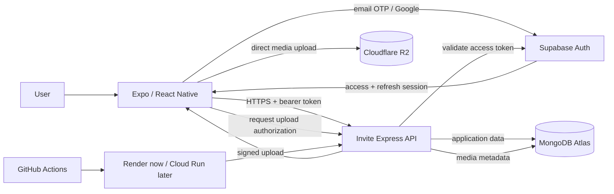
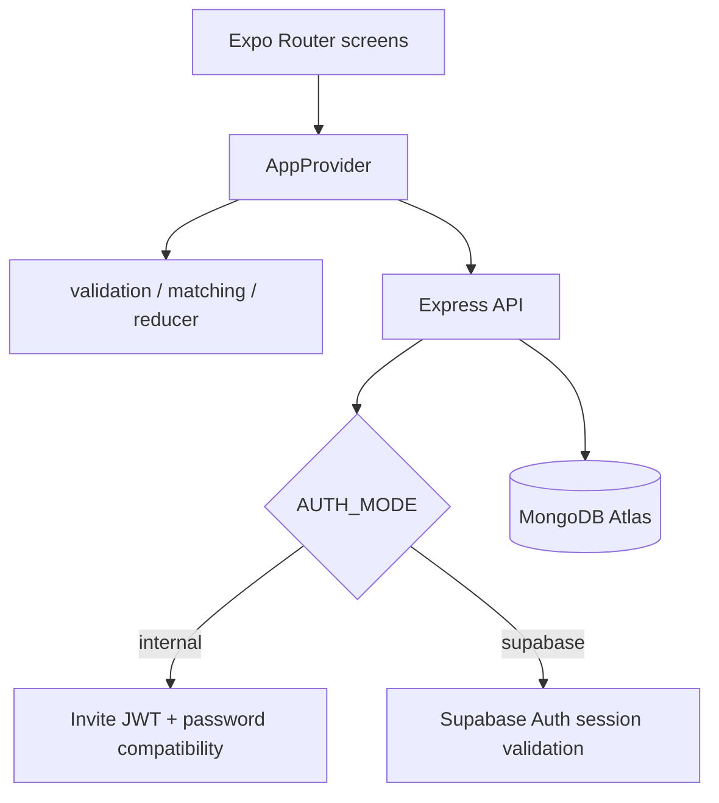
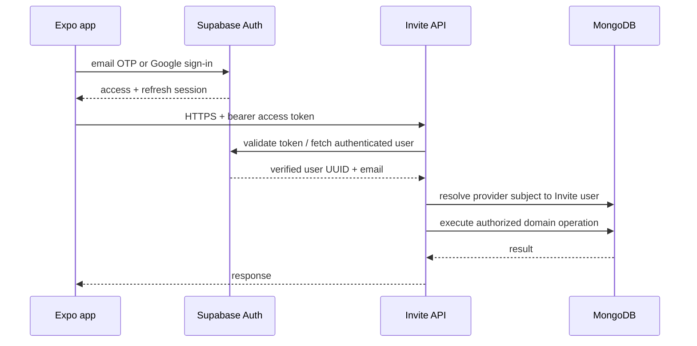

# Architecture

## Purpose

Invite is a cross-platform social activity application built with Expo and React Native. Invite owns its product domain—activities, invitations, visibility, capacity, trust and moderation—while commodity identity and infrastructure stay behind explicit boundaries.

The current target stack is:

- Expo / React Native client;
- Supabase Auth for identity and sessions;
- a stateless Express API for authorization and business rules;
- MongoDB Atlas for application/domain data;
- Render now, with the API kept portable for Cloud Run later;
- Cloudflare R2 later for first-party media.

Supabase Auth does **not** make Supabase Postgres the Invite application database.

## Architecture principles

1. **Thin client.** Screens render state and call typed commands; they do not query MongoDB directly.
2. **Authoritative API.** Authentication proves identity; the Invite API owns authorization and business rules.
3. **Stateless compute.** API processes may stop or be replaced without losing domain state.
4. **Provider-neutral identity.** External identity subjects do not become IDs throughout Invite domain records.
5. **Managed persistence.** MongoDB stores application records; object storage will store uploaded media.
6. **Scale-to-zero friendly.** Startup is lightweight, Mongo pools are small, reads become paginated, and background services are avoided until needed.
7. **Portable deployment.** The API is standard Node/Express and has a Docker image so it can run on Render, Cloud Run or another container host.
8. **Real trust-boundary tests.** E2E tests authenticate through the configured identity system instead of enabling an Invite authentication bypass.

## Target architecture



### Responsibilities

| Component | Owns | Does not own |
| --- | --- | --- |
| Expo / React Native | UI, navigation, Supabase session client, local presentation/cache | authorization, database credentials, server secrets |
| Supabase Auth | email/social authentication, access/refresh sessions, external identity UUID | activities, invitations, Invite authorization, Invite profile data |
| Invite API | identity validation, authorization, validation, domain rules, orchestration | durable session state, media bytes |
| MongoDB Atlas | Invite users, identity mappings, profiles, activities, invitations, saved data, future moderation data | managed authentication sessions |
| Cloudflare R2 | future uploaded media | Invite domain records |
| GitHub Actions | quality gates, native builds, E2E orchestration | secrets embedded into app binaries |
| Render / Cloud Run | stateless API compute | durable application data |

## Implementation status

### Implemented

- Express API remains the authoritative domain boundary.
- MongoDB connection creation is lazy and uses a small autoscaling-friendly pool (`maxPoolSize=5`, `minPoolSize=0`).
- Database indexes are maintained explicitly with `npm run server:indexes`; seeding also ensures indexes.
- API startup does not wait for a MongoDB ping.
- A portable `Dockerfile` and `.dockerignore` exist.
- Authentication is behind a provider-neutral boundary with two runtime modes:
  - `internal` compatibility mode for existing binaries;
  - `supabase` mode using Supabase Auth access tokens and internal identity mappings.
- MongoDB contains `user_identities` with a unique `(provider, providerSubject)` mapping to an Invite user ID.
- Supabase-managed email OTP and Google browser OAuth client flows are implemented.
- New Supabase identities complete Invite profile/preferences onboarding through the Express API; profile data is written to MongoDB.
- Existing-email provisioning is deliberately rejected with `ACCOUNT_LINK_REQUIRED` rather than silently linking accounts.
- Resource-oriented paginated reads exist alongside compatibility `/v1/data`:
  - `GET /v1/me`
  - `GET /v1/activities?limit=&cursor=`
  - `GET /v1/people?limit=&cursor=`
  - `GET /v1/invitations?direction=&limit=&cursor=`
  - `GET /v1/saved?limit=&cursor=`
- Stable UI selectors and a manual Android/Maestro compatibility E2E workflow exist.

### External configuration still required

- Configure the Supabase email template to display `{{ .Token }}` so the app receives a six-digit OTP rather than only a magic link.
- Configure Google OAuth in Google Cloud and Supabase Auth.
- Add Supabase public client variables to managed Expo/GitHub builds.
- Use an isolated API/database for automated managed-auth E2E.
- Configure Cloudflare R2 when first-party image upload is implemented.
- Configure Apple sign-in before iOS production if it becomes a product requirement.

See [SUPABASE_AUTH_SETUP.md](./SUPABASE_AUTH_SETUP.md) for exact configuration and rollout details.

## Current runtime paths



A legacy direct-Supabase data adapter still exists in the client for historical compatibility, but it is **not** the target production data architecture. When `EXPO_PUBLIC_API_URL` is configured, the Mongo-backed Invite API path takes precedence.

## Authentication and authorization

Authentication answers **who the caller is**. Authorization answers **what that caller may do in Invite**.

Target authentication methods:

1. email one-time code;
2. Google;
3. Apple later if required for iOS production.

The Invite API continues to enforce rules such as:

- only an activity host can send invitations;
- only the invitation receiver can accept or decline;
- only the sender can cancel a pending invitation;
- invite-only activities stay hidden from unrelated users;
- a member can update only their own profile;
- final-slot capacity is enforced atomically on the server.

### Internal identity mapping

Supabase's user UUID is mapped to a stable Invite user ID.

```text
user_identities
  _id
  userId
  provider            # supabase
  providerSubject     # Supabase Auth user UUID
  email
  emailVerified
  createdAt
  updatedAt
```

Domain records continue referencing Invite IDs:

```text
activity.hostId       -> Invite user ID
invitation.senderId   -> Invite user ID
invitation.receiverId -> Invite user ID
saved.userId          -> Invite user ID
```

This keeps the identity provider replaceable and prevents authentication-provider identifiers from leaking throughout the domain model.

### Request flow in Supabase mode



The current server validates each Supabase bearer token against Supabase Auth's authenticated-user endpoint. This is simple and signing-key agnostic for the migration. A future optimization may validate asymmetric JWTs locally against cached Supabase JWKS after measuring whether the extra network hop matters.

No Supabase service-role key is required for this request path.

## New-user provisioning and account linking

A successfully authenticated Supabase identity is not automatically an Invite member.

For a new identity:

1. Supabase verifies the email/social identity.
2. Invite asks for display name, city, interests, availability and connection goals.
3. The API verifies the Supabase access token again.
4. The API checks for an existing `(supabase, subject)` mapping.
5. The API requires a verified email.
6. If an existing Invite member already has that email, the API returns `ACCOUNT_LINK_REQUIRED`.
7. Otherwise, the API creates the Invite member and identity mapping in one MongoDB transaction.

Matching an email string alone is not sufficient proof for account migration. A future legacy-account linking flow must require recent proof of control of both the old Invite account and the Supabase identity.

## API design

### Stateless requests

```text
request
  -> validate identity
  -> resolve Invite user
  -> validate input
  -> authorize domain operation
  -> query/update MongoDB
  -> return response
```

No important user or domain state exists only in process memory.

### Resource-oriented reads

The original `/v1/data` endpoint remains temporarily for binary compatibility. New code should migrate screen-by-screen toward smaller endpoints. List endpoints use bounded page sizes and opaque cursor pagination.

### Writes and concurrency

Invitation/capacity transactional correctness remains authoritative. For invitation acceptance:

1. authenticate and resolve the Invite user;
2. verify the caller is the invitation receiver;
3. begin a MongoDB transaction;
4. atomically add the receiver only if capacity remains;
5. mark the invitation accepted;
6. commit both changes together;
7. update client state only after server success.

Automatic retries for writes require idempotency semantics first.

## MongoDB architecture

Default small-instance connection settings:

```text
maxPoolSize = 5
minPoolSize = 0
maxIdleTimeMS = 30000
```

Startup and maintenance are separated:

```text
API startup
  -> load configuration
  -> start HTTP server
  -> connect to MongoDB lazily on first database request

maintenance
  -> npm run server:indexes
  -> npm run server:seed
```

A cold-started container does not reseed data or recreate indexes.

## Media architecture

Cloudflare R2 is planned, not active. The intended upload path is direct-to-object-storage through API-issued upload authorization; the API should not proxy multi-megabyte image bodies unless required for a specific security reason.

## Client state and caching

- Supabase Auth session material is persisted by the Supabase client storage adapter.
- The access token is supplied to the existing Mongo API adapter through a managed token-provider boundary.
- AsyncStorage may cache non-sensitive application data.
- The API remains authoritative for writes.
- Client permission checks improve UX but never replace server authorization.
- The current global `AppProvider` is acceptable for the MVP; migrate growing paginated server state toward a query/cache layer rather than permanent global context expansion.

## Deployment architecture

Today:

```text
Expo app -> Render API -> MongoDB Atlas
       \-> Supabase Auth
```

The API remains a normal Node/Express service with a provider-neutral Docker image. Render is suitable for development/private beta; Cloud Run remains an optional later target.

## Environment separation

| Environment | Identity | API | MongoDB | Purpose |
| --- | --- | --- | --- | --- |
| development | Supabase development project | dev API | isolated dev DB | developer iteration |
| E2E | Supabase test/development identity | isolated E2E API | isolated E2E DB | emulator/API tests |
| production | production Supabase configuration | production API | production DB | real users |

Automated E2E must never target production identity plus production data.

## Repository direction

```text
src/
  app/                  routes/screens
  auth/                 managed identity bridge
  components/           reusable UI
  data/                 API/session adapters
  domain/               pure business rules
  state/                application orchestration
  types/                domain contracts
  __tests__/            unit/domain tests

server/src/
  auth.ts               provider-neutral authentication boundary
  config.ts             runtime configuration
  database.ts           Mongo connection and collection contracts
  identity-router.ts    external identity -> Invite provisioning
  resource-router.ts    paginated read API
  app.ts                compatibility routes + domain mutations
  indexes.ts            explicit index maintenance
  seed.ts               development/test seed

docs/
  ARCHITECTURE.md
  SUPABASE_AUTH_SETUP.md
  TESTING.md
```

## Non-goals

The current stage does not require Kubernetes, microservices, Kafka, mandatory Redis, a separate worker, persistent WebSocket infrastructure, a custom authentication platform, or migration of Invite domain data to Supabase Postgres.

## Migration sequence

1. **Implemented:** architecture and trust-boundary documentation.
2. **Implemented:** Dockerized, scale-to-zero-friendly Express/MongoDB API.
3. **Implemented:** paginated resource endpoint foundation while preserving `/v1/data` compatibility.
4. **Implemented:** provider-neutral internal identity mapping.
5. **Implemented:** Supabase Auth client bridge, email OTP UI, Google browser OAuth and profile provisioning path.
6. **In progress:** validate the Supabase-enabled isolated Render/MongoDB environment and configure hosted email OTP template.
7. **Next:** configure Google provider and managed build variables.
8. **Next:** add real Supabase-authenticated API/device tests against isolated infrastructure.
9. **Then:** implement explicit legacy account linking/migration and a safe production cutover window.
10. **Then:** migrate screens from bootstrap `/v1/data` state toward paginated reads/cache.
11. **Then:** retire Invite password hashes/JWT issuance after legacy clients are no longer supported.
12. **Then:** add R2 direct uploads when first-party media upload ships.

See [TESTING.md](./TESTING.md) for validation and E2E requirements.
