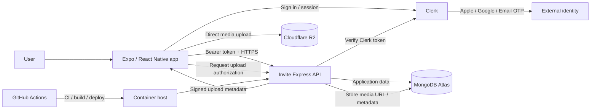
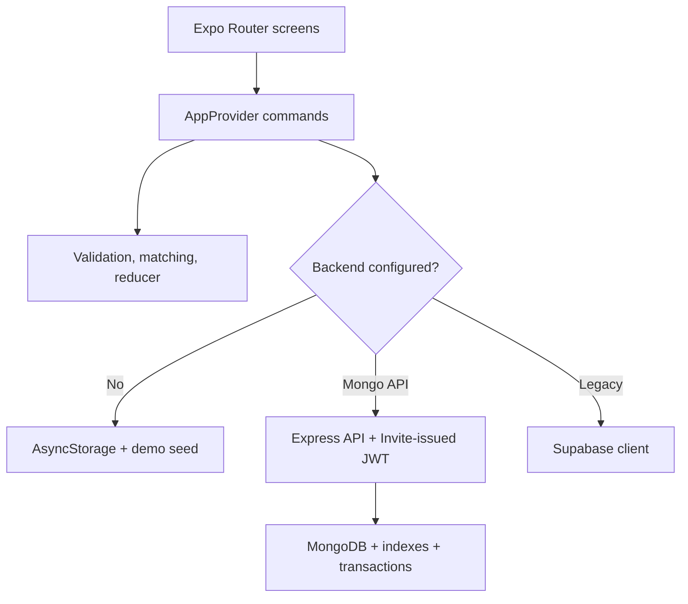
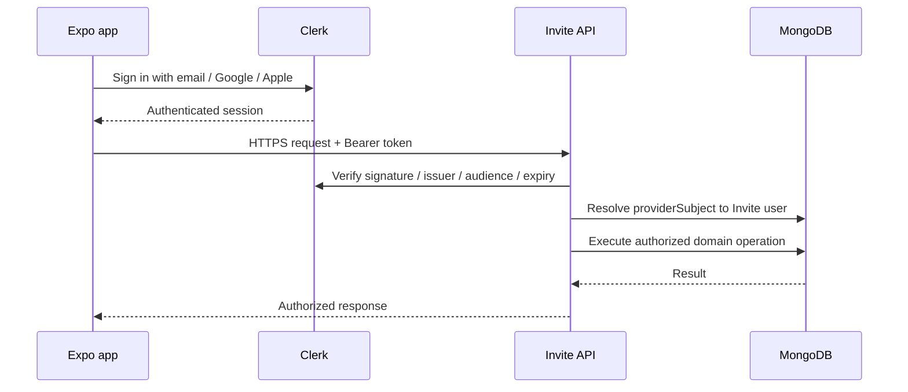
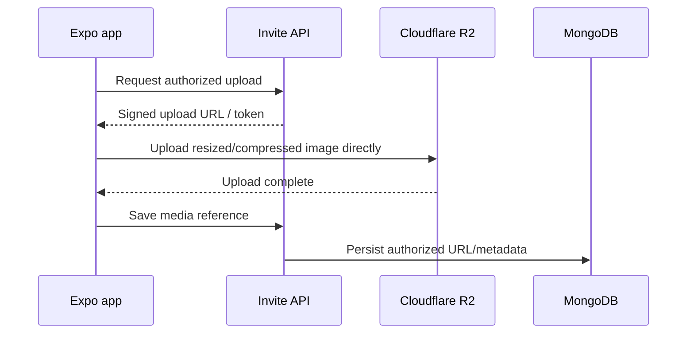

# Architecture

## Purpose

This document describes both the **current implementation** and the **target architecture** for Invite. The target architecture is the direction for new work; current behavior is documented so migrations can be incremental and reviewable.

Invite is a cross-platform social activity application built with Expo and React Native. Its core product rules—who may invite whom, who may join, capacity enforcement, visibility, matching, and invitation state transitions—belong to the Invite application domain and remain independent from hosting, authentication vendors, and client UI details.

## Architecture principles

1. **Keep the client thin.** Screens render state and invoke typed application commands; they do not query databases directly.
2. **Keep the API authoritative.** Authentication proves identity, but the Invite API owns authorization and business rules.
3. **Keep the API stateless.** A server instance may stop or be replaced without losing application state.
4. **Separate identity from Invite users.** External authentication-provider identifiers must not become domain identifiers throughout the database.
5. **Keep persistent data in managed stores.** MongoDB stores application data; object storage stores uploaded media.
6. **Design for scale-to-zero.** Startup should be lightweight, reads paginated, connection pools small, and background services avoided until needed.
7. **Prefer portability over platform-specific code.** The API should run as a standard Node container on Render, Cloud Run, or another container host.
8. **Test through real trust boundaries.** E2E tests authenticate through the configured identity provider and exercise the real API rather than enabling an application auth bypass.

## Target architecture



### Component responsibilities

| Component | Responsibility | Must not own |
| --- | --- | --- |
| Expo / React Native app | UI, navigation, local presentation state, non-sensitive cache, invoking API commands | Authorization, database credentials, server secrets |
| Clerk | Authentication, social/email sign-in, sessions, identity tokens | Invite activity/invitation rules, reputation, moderation decisions |
| Invite Express API | Token verification, authorization, validation, business rules, orchestration | Durable session state, image bytes, client-only UI state |
| MongoDB Atlas | Users, identities, profiles, activities, invitations, saves, moderation/application records | Authentication passwords after migration to Clerk |
| Cloudflare R2 | Uploaded profile/activity media | Invite business records or authorization logic |
| GitHub Actions | Quality gates, builds, E2E orchestration, deployment automation | Production secrets embedded into app artifacts |
| Render / Cloud Run | Stateless API compute | Durable application data |

## Current implementation

The repository currently supports three runtime paths:



The current MongoDB API accepts email/password credentials, hashes passwords with bcrypt, issues Invite JWTs, and stores the resulting bearer token securely on native devices. This is a valid MVP implementation, but it makes Invite responsible for credential lifecycle and account-security concerns that should move to a dedicated identity provider before public production use.

The Supabase adapter is retained as compatibility code. It is **not part of the target architecture**. New production work should target the Express/MongoDB path.

## Target authentication model

### Authentication vs authorization

Authentication answers:

> Who is this caller?

Authorization answers:

> What may this caller do in Invite?

Clerk owns authentication. The Invite API continues to own authorization.

Examples that remain API responsibilities:

- only an activity host may send invitations for that activity;
- only the invitation receiver may accept or decline;
- only the sender may cancel a sent invitation;
- invite-only activities remain hidden from unrelated users;
- a user may update only their own profile;
- capacity and final-slot concurrency rules are authoritative on the server.

### User-facing authentication methods

Target login methods:

1. Email one-time code (OTP)
2. Google
3. Apple when iOS production configuration is available

Traditional Invite-managed passwords should be removed after migration. Phone verification may later be added as a trust signal without making a phone number the canonical account identity.

### Internal identity mapping

Invite must keep a stable internal user identifier independent of Clerk.

Conceptual model:

```text
users
  _id
  publicId           # e.g. usr_01...
  status
  createdAt

userIdentities
  _id
  userId             # references users._id
  provider           # clerk
  providerSubject    # Clerk token `sub`
  email
  emailVerified
  createdAt
```

Domain records reference the Invite user, not the Clerk subject:

```text
activity.hostId       -> Invite user ID
invitation.senderId   -> Invite user ID
invitation.receiverId -> Invite user ID
saved.userId          -> Invite user ID
```

This prevents authentication-vendor identifiers from leaking through the entire domain and makes future provider migration or identity linking manageable.

### Request authentication flow



The app may use the Clerk SDK's secure native session handling. A Clerk secret key must never be embedded in an Expo build.

## API design

### Stateless request model

A normal request should be independent of server-instance memory:

```text
request
  -> verify identity
  -> resolve Invite user
  -> validate input
  -> authorize operation
  -> query/update MongoDB
  -> return response
```

No important user/session/domain state should exist only inside the Node process.

### Resource-oriented reads

The current broad `/v1/data` bootstrap is convenient for the MVP, but it should not remain the primary production read model as data grows.

Target endpoints should load only what a screen needs, for example:

```text
GET /v1/me
GET /v1/activities?limit=20&cursor=...
GET /v1/activities/:id
GET /v1/people?limit=20&cursor=...
GET /v1/invitations?direction=received&limit=20&cursor=...
GET /v1/invitations?direction=sent&limit=20&cursor=...
GET /v1/saved?limit=20&cursor=...
```

Feeds and discovery endpoints should use stable cursor pagination rather than returning unbounded collections. Deep `skip` pagination should be avoided for large collections.

### Writes and concurrency

The existing atomic capacity checks and invitation acceptance transaction are important correctness guarantees and remain part of the target architecture.

For a representative invitation acceptance:

1. The screen submits `respondToInvitation(invitationId, 'accepted')`.
2. The API verifies the Clerk token and resolves the Invite user.
3. The API verifies that the caller is the invitation receiver.
4. A MongoDB transaction atomically adds the receiver to the activity and marks the invitation accepted.
5. The activity update uses a capacity expression so concurrent final-slot attempts cannot overbook.
6. The client updates local state only after remote success.

Where retries could duplicate a write, operations should become idempotent or accept an idempotency key before automatic write retries are introduced.

## MongoDB architecture

MongoDB is the authoritative application datastore.

### Connection strategy

The API should remain friendly to scale-to-zero/container autoscaling:

- use a small connection pool per instance;
- allow the pool to return to zero idle connections where practical;
- avoid opening large pools during cold start;
- keep server startup separate from seed/migration/index maintenance work.

A starting configuration should be tested around a small pool such as `maxPoolSize: 5`, rather than assuming the current larger pool is required.

### Startup vs maintenance

Target separation:

```text
API startup
  -> load configuration
  -> connect / lazily establish MongoDB access
  -> start HTTP server

maintenance commands
  -> create/verify indexes
  -> seed development/E2E data
  -> perform explicit migrations
```

Deploying a new API instance should not reseed data or perform expensive maintenance work on every cold start.

### Data ownership

MongoDB continues to store:

- Invite users and external identity mappings;
- member profiles;
- activities and attendee sets;
- invitations;
- saved activities;
- future moderation, block/report, attendance, and reputation records.

Password hashes should disappear from production member records once Clerk migration is complete.

## Media architecture

Uploaded image bytes should not transit through the Invite API in normal operation.

Target flow:



The mobile app should resize/compress profile images before upload. MongoDB stores media URLs/metadata, not image blobs.

R2 is a planned component and is not required until first-party image upload is implemented.

## Client state and caching

The app currently uses a typed `AppProvider`, pure domain functions, and AsyncStorage for local/demo persistence.

Target client rules:

- sensitive auth/session data uses the identity SDK's secure native storage path;
- AsyncStorage may cache non-sensitive feed/profile/activity responses;
- cached data may be rendered immediately and refreshed in the background;
- the API remains authoritative for mutations;
- production mutations are not blindly queued offline;
- client-side permission checks improve UX but never replace API authorization.

As pagination, invalidation, and server-state caching grow, introduce a server-state library such as TanStack Query rather than expanding one global context indefinitely.

## Deployment architecture

### Current free-tier deployment

```text
Expo app
   -> Render free web service
       -> MongoDB Atlas
```

This is appropriate for development, demos, and private beta. Free hosts may sleep, so clients should tolerate cold starts for read requests.

### Portable target

The API should be packaged as a standard Docker container:

```text
GitHub
  -> CI
  -> Docker image
  -> Render now
  -> Cloud Run later if useful
```

The application must not rely on Render-specific runtime behavior. Moving hosts should primarily be a deployment change.

For Cloud Run or similar autoscaling platforms, start with:

- minimum instances: `0`;
- a deliberately small maximum instance count for MVP environments;
- application data externalized to MongoDB/R2;
- no required persistent filesystem.

## Environment separation

The target system has three explicit environments:

| Environment | Identity | API | Database | Purpose |
| --- | --- | --- | --- | --- |
| Development | Clerk development instance | local or dev API | local/dev DB | Developer iteration |
| E2E / CI | Clerk development/test instance | isolated E2E API | isolated E2E DB | Deterministic automated device tests |
| Production | Clerk production instance | production API | production DB | Real users |

CI must never point an emulator at production Clerk and production MongoDB.

See [TESTING.md](./TESTING.md) for the detailed E2E trust model and authentication flow.

## Technology choices

| Concern | Target choice | Rationale |
| --- | --- | --- |
| Cross-platform runtime | Expo SDK 57 / React Native 0.86 | One native codebase and EAS/native build path |
| Navigation | Expo Router | Typed file routes and native stacks/tabs |
| Language | TypeScript strict mode | Safer domain transitions and refactoring |
| Client orchestration | React context today; server-state library when justified | Keep MVP dependency-light without making context permanent infrastructure |
| Local cache | AsyncStorage for non-sensitive data | Fast startup and offline-friendly presentation |
| Authentication | Clerk | Delegate identity, OTP/social login, session lifecycle |
| Authorization | Invite Express API | Domain rules remain product-owned and server authoritative |
| Validation | Zod | Runtime boundary validation |
| Application data | MongoDB Atlas | Existing schema, indexes, geospatial support, atomic updates/transactions |
| Object storage | Cloudflare R2 when uploads ship | Direct uploads, keep image bytes out of API compute |
| API runtime | Node / Express | Existing code, portable container deployment |
| API packaging | Docker | Render/Cloud Run portability |
| Unit tests | Jest / jest-expo | Fast deterministic domain tests |
| Device E2E | Maestro | Emulator-driven Android/iOS flows suitable for CI |

## Directory direction

Current structure remains valid, with planned boundaries added incrementally:

```text
src/
  app/                 Expo Router routes/screens
  components/          Reusable UI
  data/                Client API/cache adapters
  domain/              Pure business/domain functions
  state/               App orchestration
  types/               Domain contracts
  __tests__/           Unit/domain tests

server/src/
  auth/                 Target identity abstraction + Clerk verification
  app.ts                HTTP composition/routes (to be split as surface grows)
  database.ts           Mongo connection/access
  ...                   Domain route/services/repositories introduced incrementally

docs/
  ARCHITECTURE.md        This target/current architecture
  TESTING.md             Test and CI/E2E architecture
```

## Recommendation model

The current recommendation score remains deliberately explainable:

- activity-category interest: 45 points;
- each shared host interest: 8 points, capped at 24;
- same city: 18 points;
- reliability of 95% or higher: 8 points.

Host, attendee, and already-invited profiles are excluded. This is a deterministic MVP heuristic, not machine learning. Any later ranking model should preserve explanations, fairness monitoring, user controls, and an unranked discovery option.

## Non-goals for the current stage

Do not introduce complexity without an observed need. The target architecture intentionally does **not** require:

- Kubernetes;
- microservices;
- Kafka;
- Redis as a mandatory dependency;
- a dedicated worker service before background workloads exist;
- persistent WebSocket infrastructure before realtime product features exist;
- a custom authentication/password platform.

A single stateless API, one application database, one identity provider, and object storage are enough for the foreseeable MVP/private-beta stage.

## Migration sequence

Recommended implementation order:

1. Document architecture and E2E trust boundaries.
2. Dockerize the API and make startup lightweight.
3. Separate database maintenance/seed/index commands from normal cold start.
4. Tune MongoDB connection pooling for small autoscaling instances.
5. Split broad bootstrap reads into paginated resource endpoints.
6. Introduce a provider-neutral authentication boundary in the API.
7. Integrate Clerk development authentication and internal Invite identity mapping.
8. Migrate Expo login to email OTP/Google, then Apple.
9. Remove Invite-managed password hashes and JWT issuance after migration is proven.
10. Add client caching/revalidation for free-tier cold starts.
11. Add R2 direct uploads when first-party media upload ships.
12. Move the same container from Render to Cloud Run only when operationally useful.

The testing requirements for each migration step are defined in [TESTING.md](./TESTING.md).
