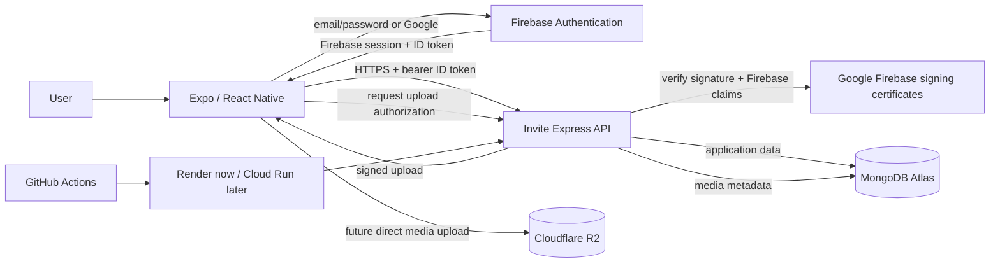
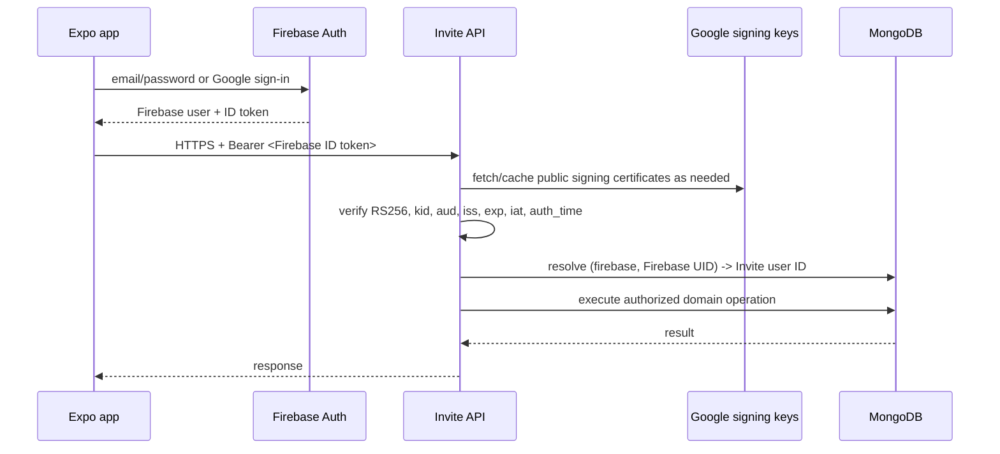

# Architecture

## Purpose

Invite is a cross-platform social activity application built with Expo and React Native. Invite owns its product domain—activities, invitations, visibility, capacity, trust and moderation—while commodity identity and infrastructure stay behind explicit boundaries.

Target stack:

- Expo / React Native client;
- Firebase Authentication for identity and sessions;
- stateless Express API for authorization and business rules;
- MongoDB Atlas for application/domain data;
- Render now, with portable container deployment for Cloud Run later;
- Cloudflare R2 later for first-party media.

Firebase is an identity provider only. It does not replace MongoDB as the Invite application database.

## Architecture principles

1. **Thin client.** Screens render state and call typed commands; they do not connect directly to MongoDB.
2. **Authoritative API.** Firebase proves identity; the Invite API owns authorization and business rules.
3. **Stateless compute.** API processes may stop or be replaced without losing domain state.
4. **Provider-neutral identity.** Firebase UIDs never become IDs throughout Invite domain records.
5. **Managed persistence.** MongoDB stores application records; object storage will store uploaded media.
6. **Scale-to-zero friendly.** Startup is lightweight, Mongo pools are small, reads are paginated, and background services are avoided until needed.
7. **Portable deployment.** The API is normal Node/Express with a Docker image.
8. **Real trust-boundary tests.** E2E tests authenticate through the configured identity system instead of enabling an Invite bypass.

## Target architecture



### Responsibilities

| Component | Owns | Does not own |
| --- | --- | --- |
| Expo / React Native | UI, navigation, Firebase client session, local presentation/cache | authorization, database credentials, server secrets |
| Firebase Authentication | email/password, email verification, password reset, Google identity, Firebase UID/session | Invite profiles, activities, invitations, Invite authorization |
| Invite API | Firebase token validation, internal-user resolution, authorization, validation, domain rules | Firebase credentials, durable session state, media bytes |
| MongoDB Atlas | Invite users, identity mappings, profiles, activities, invitations, saved data, future moderation data | managed authentication sessions |
| Cloudflare R2 | future uploaded media | Invite domain records |
| GitHub Actions | quality gates, native builds, E2E orchestration | secrets embedded into app binaries |
| Render / Cloud Run | stateless API compute | durable application data |

## Authentication modes

The API intentionally keeps two runtime modes during migration:

```text
AUTH_MODE=internal   # compatibility for existing binaries
AUTH_MODE=firebase   # target managed identity mode
```

A Firebase-enabled client activates only when `EXPO_PUBLIC_API_URL` and complete Firebase public client configuration are present. This prevents the default compatibility preview from sending Firebase tokens to an internal-auth API.

## Firebase request flow



The server validates Firebase ID tokens without a Firebase Admin service-account key. It pins `aud` to `invite-someone-app`, pins the issuer to `https://securetoken.google.com/invite-someone-app`, and caches Google's public certificates according to their cache headers.

## Internal identity mapping

MongoDB stores a stable mapping:

```text
user_identities
  _id
  userId
  provider            # firebase
  providerSubject     # Firebase UID
  email
  emailVerified
  createdAt
  updatedAt
```

Domain records continue referencing Invite IDs:

```text
activity.hostId       -> Invite user ID
invitation.senderId   -> Invite user ID
invitation.receiverId -> Invite user ID
saved.userId          -> Invite user ID
```

Historical provider values such as `clerk` or `supabase` may remain in old isolated/test data, but the target provider is `firebase`.

## Registration, verification and provisioning

Email registration uses Firebase email/password. Firebase sends the verification email and password-reset email; Invite never stores or sees the Firebase password.

A successfully authenticated Firebase identity is not automatically an Invite member. Provisioning requires a verified email:

1. Firebase authenticates the user.
2. Email/password users verify their email; Google identities normally arrive with a verified email claim.
3. Invite asks for display name, city, interests, availability and connection goals.
4. The API validates the Firebase ID token again.
5. The API checks for an existing `(firebase, uid)` mapping.
6. If an existing Invite member already uses the email but no Firebase mapping exists, the API returns `ACCOUNT_LINK_REQUIRED`.
7. Otherwise, the API creates the Invite member and identity mapping in one MongoDB transaction.

Email equality alone is never used as proof for legacy account migration. A future linking flow must require recent proof of control of both identities.

## Authorization

Authentication answers **who the caller is**. The Invite API still decides **what that caller may do**.

Examples of server-enforced rules:

- only an activity host can send invitations;
- only the receiver can accept or decline an invitation;
- only the sender can cancel a pending invitation;
- invite-only activities stay hidden from unrelated users;
- a member can update only their own profile;
- final-slot capacity is enforced atomically;
- invitation acceptance and attendee insertion commit together in a MongoDB transaction.

Client permission checks improve UX but never replace these server rules.

## API and MongoDB

Resource-oriented reads coexist temporarily with compatibility `/v1/data`:

- `GET /v1/me`
- `GET /v1/activities?limit=&cursor=`
- `GET /v1/people?limit=&cursor=`
- `GET /v1/invitations?direction=&limit=&cursor=`
- `GET /v1/saved?limit=&cursor=`

Default MongoDB pool settings remain scale-to-zero friendly:

```text
maxPoolSize = 5
minPoolSize = 0
maxIdleTimeMS = 30000
```

Startup does not ping, seed, or rebuild indexes. Maintenance is explicit:

```bash
npm run server:indexes
npm run server:seed
```

## Client session and state

- Firebase Auth persistence uses AsyncStorage on React Native.
- The Firebase bridge listens for ID-token changes.
- `user.getIdToken()` feeds the existing Invite API token-provider abstraction, allowing Firebase to refresh tokens normally.
- Invite domain data is reloaded after identity/provisioning changes.
- Signing out of Invite also signs out of Firebase.
- A historical direct-Supabase data adapter remains as compatibility code when the Mongo API is not configured; it is not the target auth or production-data architecture.

## Google sign-in

The current implementation uses Expo AuthSession to obtain a Google ID token and then creates a Firebase credential. Google UI is feature-gated by public per-platform OAuth client IDs. No OAuth client secret belongs in the app.

A future release can adopt `@react-native-google-signin/google-signin` if native Google UI materially improves UX enough to justify additional native configuration.

## Deployment and environment separation

```text
Expo app -> Firebase Authentication
        \-> Render Invite API -> MongoDB Atlas
```

| Environment | Identity | API | MongoDB | Purpose |
| --- | --- | --- | --- | --- |
| development | Firebase dev project/config | isolated dev API | isolated dev DB | developer iteration |
| E2E | Firebase test identities/config | isolated E2E API | isolated E2E DB | emulator/API tests |
| production | production Firebase config | production API | production DB | real users |

Automated E2E must never target production identity plus production data.

The existing production/internal-auth API is deliberately left unchanged until a Firebase-enabled production client is ready. The isolated auth-development Render service can use `AUTH_MODE=firebase` first.

## Repository direction

```text
src/
  app/                  routes/screens
  auth/                 Firebase -> Invite session bridge
  components/           reusable UI
  data/                  Firebase/API/session adapters
  domain/                pure business rules
  state/                 application orchestration
  types/                 domain contracts
  __tests__/              unit/domain tests

server/src/
  auth.ts                internal/Firebase verification boundary
  config.ts              runtime configuration
  database.ts            Mongo connection and collection contracts
  identity-router.ts     Firebase identity -> Invite provisioning
  resource-router.ts     paginated read API
  app.ts                 compatibility routes + domain mutations
  indexes.ts             explicit index maintenance
  seed.ts                development/test seed

docs/
  ARCHITECTURE.md
  FIREBASE_AUTH_SETUP.md
  TESTING.md
```

## Non-goals

The current stage does not require Kubernetes, microservices, Kafka, mandatory Redis, a separate worker, persistent WebSockets, migration of Invite data to Firebase databases, or Firebase Admin credentials merely to verify ID tokens.

## Migration sequence

1. **Implemented:** Express/MongoDB API and transactional domain boundary.
2. **Implemented:** provider-neutral internal Invite identity mapping.
3. **Implemented:** Firebase JS client bridge with persisted sessions.
4. **Implemented:** Firebase email/password registration, verification, password reset, and sign-in UI.
5. **Implemented:** Google OAuth integration path, gated on platform OAuth client IDs.
6. **Implemented:** Firebase ID-token verification using Google's public certificates; no service-account key.
7. **In progress:** validate the isolated Firebase-enabled Render/MongoDB environment.
8. **Next:** configure Google client IDs and run provider/device smoke tests.
9. **Next:** add real Firebase-authenticated API/device integration tests against isolated infrastructure.
10. **Then:** implement explicit legacy account linking and a safe production cutover window.
11. **Then:** retire Invite password hashes/JWT issuance after legacy clients are unsupported.
12. **Then:** add R2 direct uploads when first-party media ships.

See [FIREBASE_AUTH_SETUP.md](./FIREBASE_AUTH_SETUP.md) and [TESTING.md](./TESTING.md).
