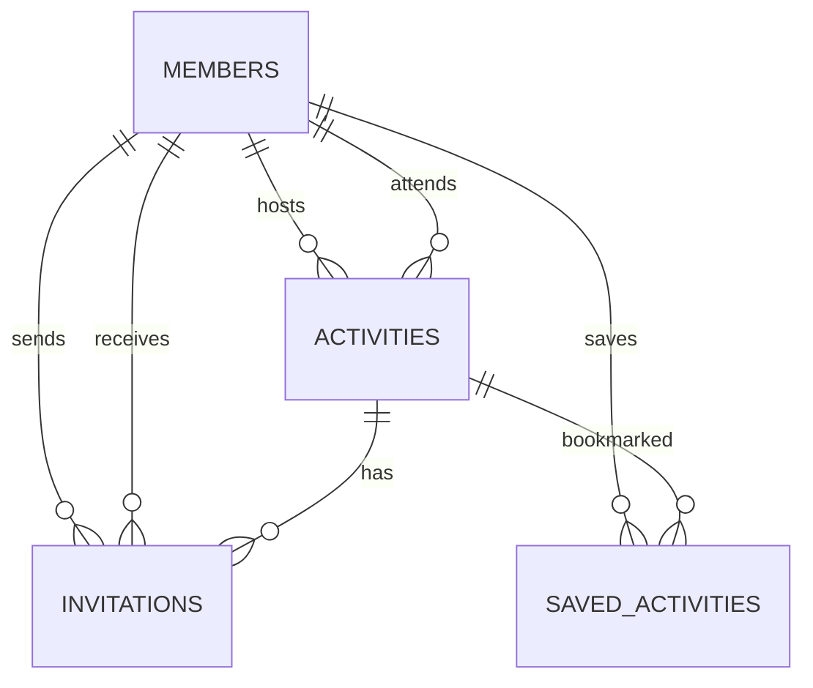

# Data model and authorization

The preferred production model is implemented by the MongoDB API in `server/src`. The mobile client never receives the database connection string and only works with camelCase domain contracts. The earlier [Supabase migration](../supabase/migrations/20260815000000_initial_schema.sql) remains as a compatibility backend.

## Entity relationships

## MongoDB collections

### `members`

One document per identity. Private fields are normalized email and bcrypt password hash. The nested public profile contains name, handle, photo URL, headline, bio, city, broad area centroid, initials/color, interests, availability, connection goals, activity count, reliability, and verification state. The API returns email only to the document owner. `mapPoint` is a GeoJSON copy of the coarse centroid for the `2dsphere` index; it must never contain a home or live GPS coordinate.

### `activities`

Stores the host, copy, category, time, place, city, 2–30 capacity, visibility, vibe, and embedded attendee IDs. The API generates IDs and always inserts the host as the first attendee. Joining uses one conditional `$addToSet` update with a `$size < capacity` expression, preventing duplicates and concurrent overbooking.

### `invitations`

Stores sender, receiver, activity, optional personal note, timestamps, and `pending | accepted | declined | cancelled`. A sparse unique `activeKey` prevents concurrent duplicate invitations while allowing a cancelled invitation to be sent again. Accepting updates invitation and activity documents in one transaction.

### `saved_activities`

Private per-user bookmarks with a unique `(userId, activityId)` index.

## API authorization summary

| Data                   | Read                                        | Create                                | Update/delete                             |
| ---------------------- | ------------------------------------------- | ------------------------------------- | ----------------------------------------- |
| Profiles               | Authenticated members; other emails omitted | Registration creates self             | Owner fields only                         |
| Community activities   | Authenticated members                       | Authenticated host as self            | Authorized host operations                |
| Invite-only activities | Host, attendee, or invited receiver         | Authenticated host as self            | Authorized host operations                |
| Attendees              | Through visible activities                  | Atomic public join or accepted invite | API-controlled                            |
| Invitations            | Sender and receiver                         | Activity host as sender               | Receiver accepts/declines; sender cancels |
| Saved activities       | Owner only                                  | Owner only                            | Owner only                                |

Route schemas discard protected client fields. The API derives user, sender, host, status, timestamps, and IDs from the authenticated request and authoritative documents.

## Integrity guarantees

- Zod schemas protect copy lengths, supported categories/states, capacity, and timestamps at the API boundary.
- Unique indexes prevent duplicate accounts, active invitations, and saves.
- `$addToSet` prevents duplicate attendees.
- A multi-document transaction connects invitation acceptance and attendance.
- One conditional update enforces capacity under concurrency.
- Indexes cover feed dates, interests, hosts, geospatial discovery, and invitation inboxes.

## Known MVP decisions

- A declined/accepted invitation keeps its active key; only cancellation permits a new attempt. A richer attempt/history model may be needed later.
- Reliability is displayed but not yet calculated from production attendance. It must not become punitive without attendance confirmation, cancellation grace, transparency, and appeals.
- City is free text and the initial API recognizes Berlin/Potsdam centroids. Production should normalize place IDs and let members choose a coarse public area without storing their exact address.
- Profiles are visible to authenticated members. Blocking and visibility preferences must be incorporated into policies before open public growth.
- Account export/deletion and cascading retention behavior require a member-facing API workflow before store launch.

## Supabase compatibility

When `EXPO_PUBLIC_API_URL` is absent and both Supabase public values are present, the app uses the original Auth/Postgres adapter. Its RLS policies, triggers, and relational constraints remain documented in the initial migration; MongoDB API rules do not weaken that backend.
