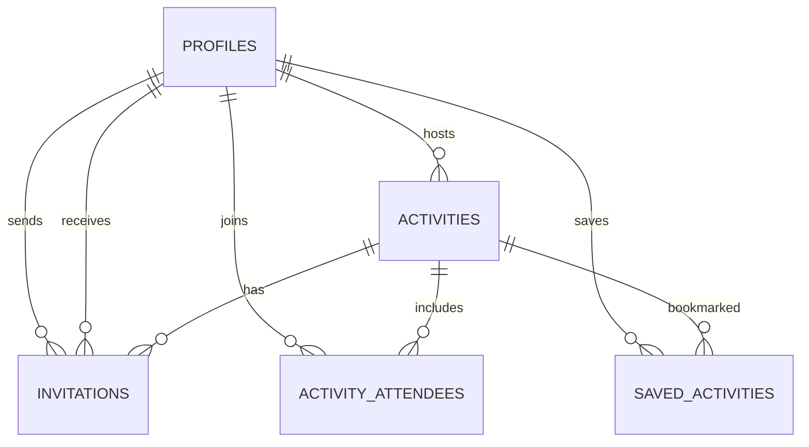

# Data model and authorization

The production schema lives in [the initial Supabase migration](../supabase/migrations/20260815000000_initial_schema.sql). Client models use camelCase; database rows use snake_case and are mapped in `src/data/supabase.ts`.

## Entity relationships

## Tables

### `profiles`

One row per `auth.users` identity. It contains public-to-members social fields: name, handle, headline, bio, city, initials/color, interests, availability, connection goals, activity count, reliability, and verification state. Email remains in Auth and is not exposed in the profile table.

### `activities`

Stores the host, copy, category, time, place, city, 2–30 capacity, visibility, and vibe. IDs are text because the offline-first client creates stable IDs before a remote insert. An insert trigger adds the host to attendees in the same transaction.

### `activity_attendees`

A composite `(activity_id, user_id)` primary key prevents duplicates. A `BEFORE INSERT` trigger locks the activity row and checks capacity, eliminating concurrent overbooking.

### `invitations`

Stores sender, receiver, activity, optional personal note, timestamps, and `pending | accepted | declined | cancelled`. A unique activity/receiver pair prevents duplicate active records in the MVP. An accepted status trigger inserts the receiver into attendees within the update transaction.

### `saved_activities`

Private per-user bookmarks with a composite primary key.

## Row Level Security summary

| Data                   | Read                                                 | Create                                             | Update/delete                             |
| ---------------------- | ---------------------------------------------------- | -------------------------------------------------- | ----------------------------------------- |
| Profiles               | Any authenticated member                             | Auth trigger                                       | Owner only                                |
| Community activities   | Any authenticated member                             | Host as self                                       | Host only                                 |
| Invite-only activities | Host and invited receiver                            | Host as self                                       | Host only                                 |
| Attendees              | Member self or participants who can see the activity | Self when host, public joiner, or accepted invitee | Self may leave; host may remove           |
| Invitations            | Sender and receiver                                  | Activity host as sender                            | Receiver accepts/declines; sender cancels |
| Saved activities       | Owner only                                           | Owner only                                         | Owner only                                |

Only `status` and `responded_at` are granted for client invitation updates, preventing identity/activity fields from being rewritten.

## Integrity guarantees

- Foreign keys cascade removal from deleted accounts/activities.
- Check constraints protect copy lengths, supported categories/states, capacity, reliability range, and valid end times.
- Composite keys prevent duplicate attendees and saves.
- Transactional triggers connect acceptance and attendance.
- Capacity is checked under a row lock.
- Indexes cover feed dates, city/category discovery, hosts, attendee lookups, and invitation inboxes.

## Known MVP decisions

- The unique invitation constraint keeps one historical invitation per activity/receiver. Supporting re-invites should add an `active` partial unique index or invitation-attempt model.
- Reliability is displayed but not yet calculated from production attendance. It must not become punitive without attendance confirmation, cancellation grace, transparency, and appeals.
- City is free text. Production discovery should normalize place IDs and use coarse location by default.
- Profiles are visible to authenticated members. Blocking and visibility preferences must be incorporated into policies before open public growth.
- Account deletion currently relies on deleting the Auth user; a member-facing deletion workflow is post-MVP and required before store launch.
