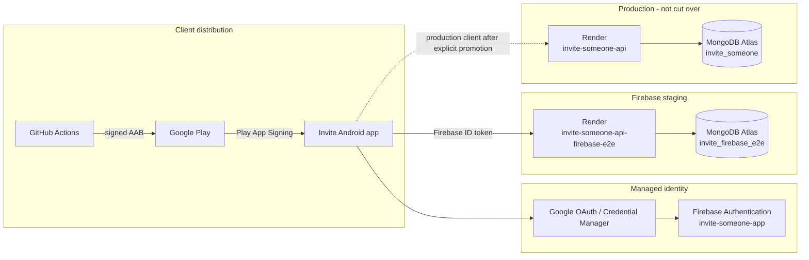
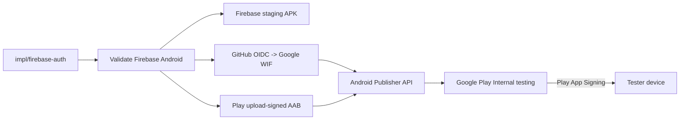

# Deployment architecture

_Last verified: 2026-09-08._

This document is the deployment source of truth for Invite. It records the environments that actually exist, which branch and service each environment uses, how Android artifacts reach Google Play, which systems own secrets, and the promotion/cutover sequence.

For implementation architecture, see [ARCHITECTURE.md](./ARCHITECTURE.md). For current release progress, see [CURRENT_STATUS.md](./CURRENT_STATUS.md). For operator procedures, see [FIREBASE_OPERATIONS_RUNBOOK.md](./FIREBASE_OPERATIONS_RUNBOOK.md) and [GOOGLE_PLAY_TESTING.md](./GOOGLE_PLAY_TESTING.md).

## System topology



Firebase supplies identity and sessions only. The Express API remains the authorization/business-rule boundary and MongoDB remains authoritative for Invite domain data.

## Environment inventory

| Environment | Branch/source | Render service | Public API | Auth mode | MongoDB database | Auto deploy | Status |
| --- | --- | --- | --- | --- | --- | --- | --- |
| Firebase staging/E2E | `impl/firebase-auth` | `invite-someone-api-firebase-e2e` | `https://invite-someone-api-firebase-e2e.onrender.com` | `firebase` | `invite_firebase_e2e` | off | active test environment |
| Production | `main` | `invite-someone-api` | `https://invite-someone-api.onrender.com` | compatibility/internal until explicit cutover | `invite_someone` | off | live; unchanged during staging work |
| Historical dev | `main` | `invite-someone-api-clerk-dev` | `https://invite-someone-api-clerk-dev.onrender.com` | historical development use | non-production | off | not part of the target Firebase release path |

All three Render services currently run in Virginia on Render's free web-service plan, use Node runtime, build with `npm ci`, and start with `npm run server:start`.

The repository also contains a portable `Dockerfile` based on Node 22.13 Alpine. Render currently uses its Node runtime rather than the Dockerfile; the Docker image is retained as the portability path for a future Cloud Run migration.

## Current deployed revisions

Deployment state and Git branch state are intentionally separate because Render auto-deploy is disabled.

- **Firebase staging branch last functionally validated SHA before documentation-only changes:** `113efe015bfee8e531a0e477bdef33974b5d30ff`.
- **Firebase staging Render live deploy:** `ea14d8105e2d09da6aebdd9ff4f272636c7d749a` (`docs: clarify Firebase server bootstrap variables`).
- **Production `main` head before this documentation refresh:** `b5f2c59c4b24939fb8f8459ffcc008bd048dc7d6`.
- **Production Render live deploy:** `d050cca0dae894159ec3e54f8476f82655f9b1a2`.

A newer branch head does not imply that Render has deployed it. Always verify the Render deploy revision before attributing backend behavior to a Git commit.

## Render deployment model

### Firebase staging

`invite-someone-api-firebase-e2e` is deliberately manual:

```text
branch: impl/firebase-auth
auto deploy: off
build: npm ci
start: npm run server:start
AUTH_MODE=firebase
FIREBASE_PROJECT_ID=invite-someone-app
MONGODB_DB_NAME=invite_firebase_e2e
MONGODB_ENSURE_INDEXES_ON_START=false during normal operation
```

The MongoDB URI and database credentials stay in Render/Atlas. They must never be copied into Expo public variables, GitHub logs, documentation, or mobile binaries.

Index creation is an explicit maintenance operation (`npm run server:indexes`). `MONGODB_ENSURE_INDEXES_ON_START=true` is only a controlled bootstrap mechanism and must be returned to `false` after the expected indexes exist.

### Production

`invite-someone-api` is also manual and remains isolated from Firebase staging work:

```text
branch: main
auto deploy: off
health check: /health
build: npm ci
start: npm run server:start
MONGODB_DB_NAME=invite_someone
```

Production must not be switched to Firebase-only authentication while unsupported compatibility clients can still reach the API. A compatible-client rollout, minimum-version gate, or temporary compatibility strategy is required before the final auth cutover.

## Android / Google Play deployment path

The Android package is permanently:

```text
com.charifmahmoudi.invite
```

The staging Android path is:



### Build/signing workflow

`.github/workflows/validate-firebase-android.yml`:

1. checks the isolated staging API;
2. generates the Android project with Expo prebuild;
3. validates Firebase native configuration;
4. builds a staging APK and verifies its known staging signing certificate;
5. builds a release AAB when Play upload signing secrets are present;
6. verifies that the AAB is not debug-signed;
7. authenticates to Google Cloud with short-lived GitHub OIDC credentials;
8. uploads the bundle through the Android Publisher API;
9. assigns it to the `internal` track with `completed` status;
10. validates and commits the Play edit.

The current Internal testing release contains Android `versionCode` **5**. Do not bump it merely to troubleshoot listing, tester, or installation issues. Increase it only for a genuine subsequent Play track release or when Play reports a version-code collision for a new upload.

### Google Cloud / Play CI trust

CI uses keyless federation:

```text
Google Cloud project: invite-someone-app
project number: 367720887571
service account: invite-play-ci@invite-someone-app.iam.gserviceaccount.com
Workload Identity Provider:
projects/367720887571/locations/global/workloadIdentityPools/github-actions/providers/github
OAuth scope: https://www.googleapis.com/auth/androidpublisher
```

No service-account JSON key is required in GitHub.

The Play upload keystore is separate from Google Cloud authentication. It is provided to GitHub Actions only through repository secrets:

```text
PLAY_UPLOAD_KEYSTORE_BASE64
PLAY_UPLOAD_STORE_PASSWORD
PLAY_UPLOAD_KEY_ALIAS
PLAY_UPLOAD_KEY_PASSWORD
```

Never commit the upload keystore or any password/private key.

## Android signing identities

These identities must not be conflated:

| Channel | Certificate role | Current SHA-1 | Firebase/Google OAuth use |
| --- | --- | --- | --- |
| GitHub staging/test APK | direct APK installation / emulator validation | `5E:8F:16:06:2E:A3:CD:2C:4A:0D:54:78:76:BA:A6:F3:8C:AB:F6:25` | register when testing that APK |
| Play upload key | authenticates AAB uploads to Play | `96:55:A1:7E:35:C7:CF:DE:67:BD:3C:E9:6C:F5:22:73:99:F8:06:A3` | not the installed Play identity |
| Play App Signing | signs APKs delivered to testers/users | `44:A2:72:01:D0:13:DE:A3:79:D1:41:92:67:6C:52:89:20:10:E6:56` | required for Play-delivered Google Sign-In |

Play App Signing SHA-256 currently recorded for operational verification:

```text
31:9F:DF:AD:0E:50:77:AA:FB:46:2C:97:35:2F:5A:BA:15:69:E9:3E:27:C3:48:BF:35:C2:67:D8:36:4E:C4:98
```

These fingerprints are public certificate identifiers, not private signing material.

## Play store-listing automation

The Android Publisher API is also used for listing maintenance. Current API-managed listing state has been verified with:

- app title present;
- short description present;
- full description present;
- public support email present;
- 512x512 Play Store icon present;
- 1024x500 feature graphic present;
- two 1080x2400 phone screenshots present.

`.github/workflows/play-store-screenshots.yml` launches a hardware-accelerated API 35 Pixel 6 emulator, installs a verified staging APK, captures real Invite screens, retains them as evidence, uploads them to the `en-US` Play listing, commits the Play edit, and verifies that Play reports at least two phone screenshots.

The screenshot workflow currently pins a specific verified APK artifact ID. When a new staging APK becomes the release candidate, update that pin or replace it with commit-aware artifact discovery before publishing replacement screenshots.

## Current Play distribution state

- Internal testing release is committed and available to the configured tester list.
- The tester opt-in page recognizes the enrolled tester account and exposes **Download test app**.
- Google Play shows an Install button for the unreviewed test build.
- **The current Play-delivered build installs successfully on the physical test phone and the application runs on that device.**
- Play visibility, eligibility, delivery, installation, and launch are therefore working.
- The release owner has explicitly **waived the full Play-installed functional acceptance suite** for this release candidate.

The waiver must be represented accurately: the suite is **not passed**; it is **not executed**. Existing CI, emulator, hosted Firebase-token, API, and MongoDB evidence remains valid for what those layers tested, but does not constitute proof of the skipped physical-device journeys.

Internal testing can operate before the app is fully configured for public production. Console-only App content/policy declarations and production-access requirements remain separate from internal-test distribution.

## Secret and configuration boundaries

### Safe to ship in the client

The following are public client configuration, not secrets:

- Firebase Web API key/config;
- Firebase project ID;
- OAuth client IDs;
- public API URL;
- package/bundle identifiers;
- signing certificate fingerprints.

### Server-only / secret

Keep these only in their appropriate secret stores:

- MongoDB URI/password;
- Play upload keystore and passwords;
- signing private keys;
- OAuth client secrets;
- Firebase service-account private keys if a future feature ever requires them;
- live Firebase ID tokens;
- any production-only administrative credential.

## Promotion and production cutover

The current release path is:

```text
staging CI
  -> hosted Firebase boundary smoke
  -> Play Internal testing publication
  -> Play installation + launch on real device [passed]
  -> full Play-installed functional acceptance suite [WAIVED; NOT PASSED]
  -> Play production-readiness / closed-test requirements as applicable
  -> re-check exact branch and Render revisions
  -> explicit fast-forward of intended staging code to main
  -> deploy/verify compatible production client path
  -> explicit production Render auth cutover
```

The skipped suite means the following Play-installed behaviors remain unverified on the physical tester device: email/password signup and verification, returning sign-in, password reset, Google Sign-In, onboarding/profile provisioning, Firebase token -> Express -> MongoDB end-to-end behavior, session persistence, logout, duplicate-identity protection in the Play-installed flow, `ACCOUNT_LINK_REQUIRED` in the Play-installed flow, background/sleep behavior, network recovery, and reinstall/update behavior.

Those items must not be recorded as passed later unless they are actually tested. Production promotion may proceed only as an explicit release-owner decision that accepts this residual risk; it must not be inferred from the waiver alone.

## Rollback principles

Before production cutover, rollback is simply **do not promote staging**; production remains independent.

After a future production cutover:

1. preserve the last known-good production client/version;
2. preserve the previous Render deployment revision;
3. do not mutate identity mappings to work around an auth incident;
4. prefer restoring a compatible server/client pair over silently linking accounts;
5. verify `/health`, authentication, and a read-only smoke before reopening normal traffic;
6. never roll back database schema by deleting user identity mappings without a migration plan.

## Operational ownership

- **GitHub**: source, CI, Android build artifacts, release evidence.
- **Google Cloud IAM**: keyless GitHub-to-Play federation.
- **Google Play**: test/production distribution, Play App Signing, store listing.
- **Firebase Authentication**: managed identity and sessions.
- **Render**: stateless Express compute.
- **MongoDB Atlas**: durable Invite domain data.

The architecture deliberately avoids storing one provider's private credentials inside another provider's public client configuration.
