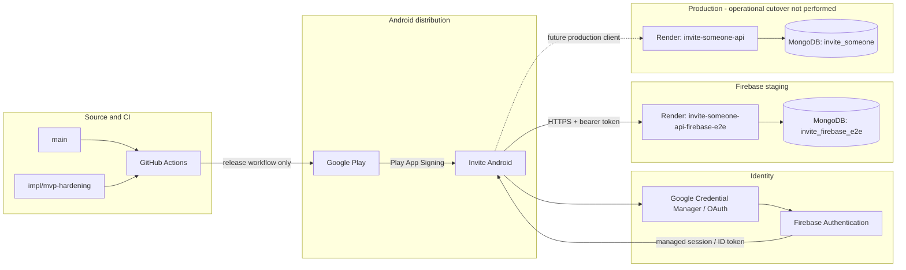

# Deployment architecture

_Last verified: 2026-09-08._

This document is the deployment source of truth for Invite. It separates **source state**, **CI/release artifacts**, and **live infrastructure state**. Those are intentionally independent because Render auto-deploy is disabled.

For application internals, see [ARCHITECTURE.md](./ARCHITECTURE.md). For active work and release state, see [CURRENT_STATUS.md](./CURRENT_STATUS.md). For public-MVP requirements, see [MVP.md](./MVP.md).

## Topology



Firebase owns authentication/session identity. The Express API owns authorization and Invite business rules. MongoDB owns Invite domain data.

## Source branches

### `main`

Firebase migration source was promoted to `main` at:

```text
4fa69eeb19c336603a5e6ea1470b24d75150a376
```

This source promotion did **not** deploy production Render and did **not** switch the live production API to Firebase authentication.

### `impl/mvp-hardening`

This branch contains the active MVP-hardening work after the Firebase source promotion. Work includes managed-auth state hardening, Android/Firebase quality gates, design-system improvements, user help/safety content, and MVP documentation.

The exact branch HEAD changes as hardening commits land; always query GitHub before using a SHA as release evidence.

No PR is required for this project workflow. Promotion to `main` must still be explicit and must not be confused with deployment.

## Live environment inventory

| Environment | Live compute | API | Auth mode | MongoDB | Auto deploy | Operational status |
| --- | --- | --- | --- | --- | --- | --- |
| Firebase staging/E2E | Render `invite-someone-api-firebase-e2e` | `https://invite-someone-api-firebase-e2e.onrender.com` | `firebase` | `invite_firebase_e2e` | off | active isolated staging backend |
| Production | Render `invite-someone-api` | `https://invite-someone-api.onrender.com` | compatibility/internal until explicit cutover | `invite_someone` | off | live and intentionally unchanged |

Historical Render services may still exist, but they are not part of the target MVP release path unless explicitly documented in `CURRENT_STATUS.md`.

## Known live revisions

Last verified before the current hardening branch work:

```text
Firebase staging Render:
  ea14d8105e2d09da6aebdd9ff4f272636c7d749a

Production Render:
  d050cca0dae894159ec3e54f8476f82655f9b1a2
```

These values are historical checkpoints, not permanent truth. Re-read Render immediately before any staging or production deployment decision.

The most important deployment invariant is:

```text
Git branch HEAD != Render live revision
```

unless a deliberate deployment has been performed and verified.

## Render model

Both staging and production use manual deployment.

Typical runtime contract:

```text
auto deploy: off
build: npm ci
start: npm run server:start
health: /health
```

### Staging

```text
AUTH_MODE=firebase
FIREBASE_PROJECT_ID=invite-someone-app
MONGODB_DB_NAME=invite_firebase_e2e
MONGODB_ENSURE_INDEXES_ON_START=false during normal operation
```

### Production

```text
MONGODB_DB_NAME=invite_someone
AUTH_MODE remains compatibility/internal until an explicit compatible-client cutover
```

Production must not be switched to Firebase-only authentication while unsupported old clients can still call the service unless a minimum-version/compatibility plan has been explicitly chosen.

## Database maintenance

MongoDB credentials remain in Render/Atlas secret configuration and never belong in the mobile bundle.

Index creation is explicit:

```bash
npm run server:indexes
```

`MONGODB_ENSURE_INDEXES_ON_START=true` may be used only for controlled bootstrap and should return to `false` afterward so scale-to-zero cold starts do not perform schema maintenance.

## Android / Google Play path

Package:

```text
com.charifmahmoudi.invite
```

Current Internal testing release:

```text
track: internal
release: Invite Internal 15
versionCode: 5
publication workflow run: 34155373675
```

VersionCode 5 remains the published Internal testing build. Do not increment it merely for documentation, CI, listing, or backend work. A future AAB release must use the next valid versionCode.

### Release workflow

`.github/workflows/validate-firebase-android.yml` is the protected build/upload path used for the Firebase staging Play release. It:

1. checks isolated staging API health;
2. runs Expo Android prebuild;
3. verifies generated Firebase configuration;
4. builds and checks a staging APK;
5. builds an upload-key-signed AAB when signing secrets are present;
6. rejects debug-signed release bundles;
7. obtains short-lived Google credentials through Workload Identity Federation;
8. uses the Android Publisher API to upload and assign the AAB to Internal testing;
9. validates and commits the Play edit.

MVP hardening does **not** automatically run this publication workflow merely because source changes. Publishing a new AAB is a release decision.

## MVP quality path

`.github/workflows/mvp-quality.yml` is intentionally separate from Play publication.

It is designed to run for `main`, `impl/mvp-hardening`, PRs targeting `main`, and manual dispatch. It contains:

### Firebase -> API boundary

- creates a disposable genuine Firebase identity;
- verifies the isolated Firebase staging API accepts the token boundary;
- proves an unmapped identity gets `INVITE_PROFILE_REQUIRED`;
- proves unverified provisioning gets `VERIFIED_EMAIL_REQUIRED`;
- deletes the disposable Firebase identity.

### Android managed-auth + core navigation

- builds a Firebase-enabled Android release APK;
- uses API 35 / Pixel 6 emulator;
- uses KVM when the runner exposes `/dev/kvm`, otherwise permits software fallback;
- runs a real Firebase invalid-credential UI journey;
- runs a clean-state demo/core navigation journey;
- retains Maestro evidence.

This workflow:

```text
DOES NOT deploy Render
DOES NOT modify MongoDB configuration
DOES NOT publish to Google Play
DOES NOT bump Android versionCode
```

## Google Cloud / Play CI trust

Release automation uses keyless GitHub OIDC federation:

```text
Google Cloud project: invite-someone-app
project number: 367720887571
service account: invite-play-ci@invite-someone-app.iam.gserviceaccount.com
provider:
projects/367720887571/locations/global/workloadIdentityPools/github-actions/providers/github
```

Android Publisher OAuth scope:

```text
https://www.googleapis.com/auth/androidpublisher
```

No Google service-account private JSON key is required in GitHub.

The Play upload keystore is separate from cloud authentication and is supplied only through protected repository secrets. Never commit or document private key bytes/passwords.

## Android signing identities

| Channel | Role | SHA-1 | OAuth significance |
| --- | --- | --- | --- |
| repository/test APK | direct APK/emulator signing identity | `5E:8F:16:06:2E:A3:CD:2C:4A:0D:54:78:76:BA:A6:F3:8C:AB:F6:25` | required only for that direct APK path |
| Play upload key | authenticates AAB upload | `96:55:A1:7E:35:C7:CF:DE:67:BD:3C:E9:6C:F5:22:73:99:F8:06:A3` | not the identity installed by users |
| Play App Signing | signs Play-delivered app | `44:A2:72:01:D0:13:DE:A3:79:D1:41:92:67:6C:52:89:20:10:E6:56` | required for Google Sign-In in Play-installed builds |

Recorded Play App Signing SHA-256:

```text
31:9F:DF:AD:0E:50:77:AA:FB:46:2C:97:35:2F:5A:BA:15:69:E9:3E:27:C3:48:BF:35:C2:67:D8:36:4E:C4:98
```

Certificate fingerprints are public identifiers; private signing material must remain secret.

## Play listing state

The listing has the required API-managed basics:

- title;
- short/full descriptions;
- support email;
- icon;
- feature graphic;
- two phone screenshots.

The two existing screenshots were captured from the real staging app, but later review of the retained evidence found a visible Android system `Quickstep isn't responding` dialog over both images. They must therefore be treated as **technically uploaded but creatively unacceptable**.

The hardening capture script rejects screenshots when an Android ANR/error dialog remains visible. Regenerating clean listing screenshots is a release-presentation task; it does not require a new AAB by itself when the intended app build is unchanged.

## Current physical distribution evidence

Verified:

- tester enrollment works;
- opt-in/download path works;
- Internal testing build is visible;
- Play-delivered versionCode 5 installs successfully on the physical test phone;
- Invite launches/runs on that phone.

The release owner explicitly waived the earlier full Play-installed functional suite. Therefore those unexecuted journeys remain **waived/not passed**. See [TESTING.md](./TESTING.md) for the exact list.

## Secret boundaries

### Public client configuration

Safe to embed by design:

- Firebase public Web/app configuration;
- Firebase project ID;
- OAuth client IDs;
- public HTTPS API URL;
- package/bundle identifiers;
- certificate fingerprints.

### Secret / server-only

Never place in public app config, documentation, or build logs:

- MongoDB URI/password;
- signing private keys/keystores/passwords;
- OAuth client secrets;
- service-account private keys;
- live Firebase ID/refresh tokens;
- password-reset links;
- production administrative credentials.

## Promotion model

Source and infrastructure have separate gates.

### Source promotion

A future `impl/mvp-hardening` -> `main` promotion should occur only after the intended candidate SHA has green required checks and the documentation accurately records known gaps/waivers.

This operation still does **not** deploy production.

### Staging backend deployment

If hardening requires a changed staging API binary:

1. identify exact candidate SHA;
2. manually deploy that revision to `invite-someone-api-firebase-e2e`;
3. verify Render reports that exact revision;
4. verify `/health`;
5. run hosted Firebase/API and relevant Android E2E;
6. record the new live staging revision.

### Production cutover

Production remains an explicit future operation:

1. select exact `main` SHA;
2. re-read production Render current revision/config;
3. confirm client/server auth compatibility strategy;
4. confirm database/index state;
5. define rollback revision and compatibility behavior;
6. manually deploy the intended server revision;
7. verify Render reports the exact deployed SHA;
8. verify `/health` and production smoke behavior;
9. only then change auth mode or production distribution as explicitly planned.

No production cutover has been performed by the MVP-hardening work documented here.

## Rollback principles

- Before production cutover: leave production unchanged.
- After a future cutover: preserve the previous known-good Render revision/client pairing.
- Never “repair” an auth incident by silently creating email-based identity mappings.
- Prefer restoring a compatible client/server pair over mutating identity ownership.
- Never delete identity mappings or user data as an ad-hoc rollback strategy.
- Verify read-only health/auth behavior before reopening normal traffic after rollback.

## Operational ownership

- **GitHub** — source, CI, Android artifacts, evidence.
- **Google Cloud IAM** — GitHub-to-Play keyless trust.
- **Google Play** — distribution, Play App Signing, store listing.
- **Firebase Authentication** — user identity/session provider.
- **Render** — stateless Express compute.
- **MongoDB Atlas** — durable Invite domain/identity-mapping data.

The architecture intentionally keeps private credentials out of the mobile client and keeps source promotion independent from live infrastructure mutation.
