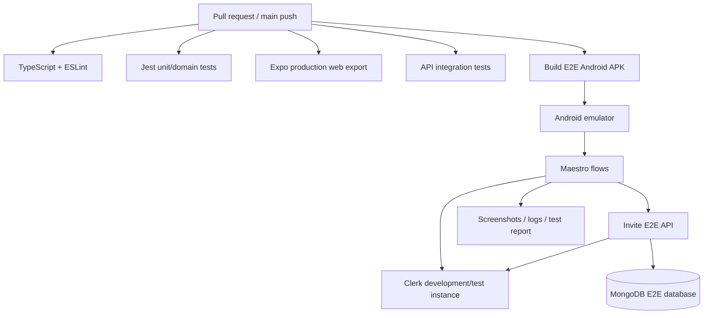

# Testing strategy and CI/E2E architecture

## Purpose

This document defines how Invite is tested from pure domain functions through a real mobile emulator. It also defines the trust boundaries for CI authentication so automated tests remain deterministic without weakening production authentication.

The goal is not to maximize test count. The goal is to place the right tests at the layer that owns the behavior:

- pure product rules are tested quickly in Jest;
- API authorization and concurrency are tested against MongoDB;
- critical user journeys are tested through an Android/iOS app build;
- CI uses real authentication sessions in an isolated environment, not an Invite auth bypass.

See [ARCHITECTURE.md](./ARCHITECTURE.md) for the application architecture this strategy protects.

## Test architecture overview



Target layering:

```text
                 few, high-value
             ┌────────────────────┐
             │ Device E2E         │
             │ Maestro + emulator │
             ├────────────────────┤
             │ API integration    │
             │ auth + Mongo       │
             ├────────────────────┤
             │ Component tests    │
             │ critical UI states │
             ├────────────────────┤
             │ Domain/unit tests  │
             │ reducer/validation │
             ├────────────────────┤
             │ Static/build gates │
             │ TS/lint/export     │
             └────────────────────┘
                 many, very fast
```

## Current quality gates

The repository currently runs:

1. strict TypeScript compilation;
2. ESLint, including React Hooks/compiler rules;
3. Jest tests with coverage for configured domain files;
4. a production static web export;
5. an Android native preview build on pull requests and `main` updates.

The native preview workflow builds the Android release variant and verifies that `assets/index.android.bundle` is embedded in the APK. It uploads the APK and SHA-256 checksum as GitHub Actions artifacts. Updates to `main` also publish the development-signed prerelease APK.

Run the current checks locally:

```bash
npm run typecheck
npm run lint
npm run test:ci
npm run export:web -- --output-dir dist
```

These checks remain useful. The target architecture adds API integration and device E2E gates rather than replacing them.

## Unit and domain tests

### Runtime validation

`validation.test.ts` covers registration/profile/activity validation and protects inputs before state or remote writes.

### Recommendation behavior

`matching.test.ts` verifies declared matching signals, exclusions, explanations, and ranking behavior.

`profile-discovery.test.ts` verifies biography/area search, combined interests/availability/goals/verification/distance filters, approximate distance calculations, and bounded map projection.

### User-story transitions

`app-reducer.test.ts` exercises activity creation, invitations, acceptance, decline, public joining, duplicate prevention, and saving.

These tests are intentionally pure and deterministic. They protect client/domain state transitions but **do not prove server authorization or database concurrency correctness**.

## API integration tests

Before production release, the backend should have a real integration suite against an isolated MongoDB database. Because invitation acceptance uses transactions, CI should use a MongoDB configuration that supports transactions (for example an ephemeral replica set or a dedicated test cluster configured appropriately).

Required API scenarios include:

- unauthenticated protected reads fail;
- malformed, expired, wrong-issuer, and wrong-audience identity tokens fail;
- a member cannot update another member's profile;
- invite-only activities are hidden from unrelated members;
- only an activity host can create invitations;
- a receiver can accept/decline but cannot cancel as sender;
- a sender can cancel but cannot accept for the receiver;
- simultaneous final-slot joins produce one success and one capacity failure;
- invitation acceptance and attendee insertion roll back together when capacity is unavailable;
- saved activities are private to their owner;
- public profile responses do not expose private email/authentication fields;
- coarse geospatial queries respect the requested maximum distance;
- identity-provider subjects resolve to the correct internal Invite user;
- one external identity cannot silently become another Invite user;
- disabled/suspended Invite users are rejected even when their external authentication session remains valid.

The Supabase compatibility backend does not define the target production architecture. If it remains in a supported release, it needs its own compatibility tests; otherwise it should be removed rather than silently diverging.

## E2E environment model

Automated device tests must run in an isolated environment:

```text
GitHub Actions
      |
      v
Android emulator
      |
      v
Invite E2E APK
      |
      +------> Clerk DEVELOPMENT / TEST identity instance
      |
      v
Invite E2E API
      |
      v
MongoDB invite_e2e database
```

The E2E app must never use both production authentication and production application data.

### Environment separation

| Environment | Clerk | API | MongoDB | Test data |
| --- | --- | --- | --- | --- |
| Developer local | Development | local/dev | local/dev | developer-owned |
| CI E2E | Development/test | isolated E2E | `invite_e2e` or equivalent | deterministic/resettable |
| Production | Production | production | production | real users |

A test build should make its environment visible in logs/build metadata so accidental production targeting is easy to diagnose.

## CI authentication model

### Principle: authenticate for real, do not bypass Invite auth

Do not add code such as:

```text
if E2E_BYPASS_AUTH:
  treat caller as test user
```

Such a path would make tests easier while leaving the actual authentication integration untested and could become a production security risk.

Instead, the emulator should perform a real sign-in through a Clerk development/test instance and receive a normal Clerk session/token. The Invite API verifies that token exactly as it verifies other non-production Clerk tokens for that environment.

### Deterministic Clerk test identities

For automated email-code authentication, use Clerk test email addresses, for example:

```text
e2e-host+clerk_test@example.com
e2e-guest+clerk_test@example.com
e2e-third+clerk_test@example.com
```

In Clerk development/test mode these identities can use Clerk's deterministic test verification code:

```text
424242
```

No human should need to open an inbox during CI.

The resulting session is a real Clerk session for the configured development instance. `424242` is therefore not an Invite API backdoor and must not be implemented as a magic code in Invite itself.

### Why E2E should not depend on Google/Apple login

Google and Apple login should exist for real users, but they are poor prerequisites for every CI run because automated browser/provider flows may encounter:

- consent-screen changes;
- CAPTCHA or bot detection;
- suspicious-login challenges;
- MFA/device verification;
- provider UI changes;
- rate limiting.

Use Clerk email OTP test identities for routine CI. Test Google/Apple configuration separately with targeted smoke/manual release checks.

## Invite E2E users

Maintain a small deterministic set of test personas in the E2E environment.

Recommended minimum:

```text
HOST
  email: e2e-host+clerk_test@example.com
  Invite role: normal member
  city: Berlin
  interests: coffee, hiking

GUEST
  email: e2e-guest+clerk_test@example.com
  Invite role: normal member
  city: Berlin
  interests: coffee, photography

THIRD
  email: e2e-third+clerk_test@example.com
  Invite role: normal member
  city: Potsdam
  interests: cycling
```

The users are not privileged application administrators. Their value is predictable ownership and relationships in test fixtures.

## Identity provisioning

When the API receives a valid Clerk identity for the first time, the target architecture resolves the Clerk `sub` to an internal Invite identity mapping.

Conceptually:

```text
valid Clerk token
      |
      v
providerSubject known?
    /     \
  yes      no
   |        |
   |      provision/link Invite user
   |        |
    \      /
      v
internal Invite user
```

E2E tests may therefore either:

1. keep stable Clerk test users and stable Invite identity mappings, resetting only domain data; or
2. create unique test users for signup-specific flows and clean them up after the run.

For most feature tests, option 1 is preferred because it is faster and less brittle.

## Test data lifecycle

### Stable identities, resettable domain data

Routine E2E runs should keep stable authentication identities but reset the application scenario before execution.

Example reset scope:

```text
preserve:
  Clerk test identities
  Invite user/identity mapping if desired

reset/reseed:
  profiles to known fixture values
  activities
  invitations
  saved activities
  attendance/reputation test records
```

The reset operation should target the isolated E2E database only.

### CI setup credentials

If a setup/reset script needs privileged credentials, they live only in GitHub Actions secrets or the server-side test environment. They must never be compiled into the APK.

Acceptable:

```text
GitHub Actions secret
  -> CI setup script
  -> E2E database reset
```

Not acceptable:

```text
GitHub Actions secret
  -> EXPO_PUBLIC_* value
  -> APK
```

Any variable prefixed for public Expo inclusion must be treated as public app configuration, not a secret.

## Maestro architecture

Target directory structure:

```text
.maestro/
  config.yaml
  helpers/
    login.yaml
    logout.yaml
  auth/
    sign-in.yaml
    sign-out.yaml
    session-restoration.yaml
  activities/
    create.yaml
    join.yaml
    capacity.yaml
  invitations/
    send.yaml
    accept.yaml
    decline.yaml
  profile/
    edit.yaml
```

The exact files can be introduced incrementally as implementation proceeds.

### Stable test selectors

Critical controls and screen roots should expose stable `testID` values. Tests should prefer these over human-facing text where copy is likely to change.

Example:

```tsx
<TextInput testID="auth-email" />
<Button testID="auth-continue" />
<TextInput testID="auth-code" />
<Button testID="auth-verify" />
<View testID="home-screen" />
```

### Reusable login flow

Conceptual Maestro helper:

```yaml
- tapOn:
    id: auth-email
- inputText: ${E2E_EMAIL}
- tapOn:
    id: auth-continue
- tapOn:
    id: auth-code
- inputText: "424242"
- tapOn:
    id: auth-verify
- assertVisible:
    id: home-screen
```

The test identity is supplied by CI rather than embedding production credentials.

## E2E suite design

### Authentication flows

A small number of tests intentionally start from a clean application state:

- email OTP sign-in;
- signup/onboarding where applicable;
- sign-out;
- session restoration after app restart;
- invalid/expired session behavior.

These tests are responsible for proving the login integration.

### Feature flows

Most tests should not repeatedly prove the entire sign-in journey. Authenticate once or use a reusable login helper, then exercise the product scenario.

High-value Invite flows:

1. host creates a community activity;
2. host discovers/selects a guest and sends an invitation;
3. guest sees the invitation and accepts it;
4. accepted guest appears as an attendee;
5. a second concurrent/final-slot scenario respects capacity;
6. invite-only activity remains invisible to unrelated third user;
7. user saves/unsaves an activity;
8. user edits their own profile and sees the persisted result;
9. unauthorized role actions are unavailable in UI and rejected by API.

### Example multi-user invitation journey

```text
reset E2E scenario
      |
      v
authenticate HOST
      |
create activity
      |
send invite to GUEST
      |
sign out
      |
authenticate GUEST
      |
open received invitations
      |
accept
      |
assert activity attendee state
```

This single journey exercises Expo UI, Clerk session acquisition, API authentication, Invite authorization, MongoDB writes/transactions, and client refresh behavior.

## Application state between tests

Use state clearing intentionally.

Authentication-specific tests may launch with a clean app data state so they prove first-run/session behavior.

Feature tests may preserve the authenticated native session across related flows to avoid turning every feature test into an auth test. Test isolation should primarily come from deterministic database scenarios and explicit setup, not from arbitrarily deleting app data after every assertion.

If tests are parallelized later, give each worker isolated users/fixture namespaces or independent databases so flows cannot race each other unintentionally.

## Proposed CI workflow

Target pull-request pipeline:

```text
Pull request
  |
  +--> typecheck
  |
  +--> lint
  |
  +--> Jest/domain tests
  |
  +--> web production export
  |
  +--> API integration tests
  |
  +--> build E2E APK
          |
          v
      boot Android emulator
          |
          v
      reset/seed E2E scenario
          |
          v
      run Maestro smoke suite
          |
          v
      upload logs/screenshots/results
```

A practical implementation may split fast and slow jobs:

```text
verify (fast)
  typecheck + lint + Jest + web export

api-integration
  MongoDB-backed API tests

e2e-android (slower)
  build/install/emulator/Maestro
```

The slower E2E job can initially run on pull requests that change application/backend code and on `main`, then become a required check once runtime and reliability are acceptable.

## CI secrets and public configuration

Expected categories after Clerk/E2E implementation:

| Value | Secret? | Used by |
| --- | --- | --- |
| `EXPO_PUBLIC_CLERK_PUBLISHABLE_KEY` | No (public by design) | E2E app |
| E2E API URL | No | E2E app |
| `CLERK_SECRET_KEY` if setup/cleanup requires it | Yes | CI/server only |
| E2E MongoDB URI | Yes | CI/server only |
| production Clerk secret | Yes | production API only |
| production MongoDB URI | Yes | production API only |

Do not expose server secrets through `EXPO_PUBLIC_*` variables.

### Fork pull requests

Privileged E2E jobs must not hand repository secrets to untrusted fork code. GitHub's normal secret restrictions for forked PRs should be preserved. If the E2E environment requires secrets, run that portion only in a trusted workflow context and never use an unsafe trigger pattern that executes unreviewed PR code with production/repository secrets.

## Cold-start and free-tier behavior

Because the target API is designed for scale-to-zero hosting, E2E tests should tolerate realistic cold starts without hiding permanent failures.

For read requests, the app may use bounded retry/backoff for transient startup/network errors. E2E assertions should allow for this normal startup behavior.

Writes must not be blindly retried unless they are idempotent. Tests should specifically cover that a retried UI action cannot create duplicate invitations/activities once idempotency support is introduced.

## Manual/release matrix

Automated E2E does not eliminate release-device testing.

At minimum validate:

| Platform | Target | Focus |
| --- | --- | --- |
| iOS | Small supported iPhone | text wrapping, keyboard, modal date picker, Apple login |
| iOS | Current large iPhone | safe areas, tab reachability, haptics, session restoration |
| Android | Compact supported device | predictive back, keyboard resize, native auth flow |
| Android | Large device | responsive max width, date/time picker |
| Web | Chrome + Safari | static routing, keyboard navigation, focus, browser auth callback |

Repeat important release flows with larger system text, reduced motion, VoiceOver/TalkBack, and poor network conditions.

## Acceptance evidence

Story IDs in [USER_STORIES.md](./USER_STORIES.md) should map to automated or manual acceptance evidence. When a story changes, update its criteria and the relevant tests in the same pull request.

A passing unit test does not prove that a screen is usable. A passing E2E happy path does not prove that authorization is secure. Each layer supplies different evidence.

## Failure artifacts

Device E2E jobs should upload useful evidence on failure:

- Maestro output/report;
- screenshots captured at failure;
- emulator log excerpt where practical;
- API request/correlation IDs if available;
- build identifier/commit SHA;
- target environment identifier.

Do not upload tokens, authorization headers, secret environment variables, password hashes, or production user data in test artifacts.

## Observability for tests

As the API gains structured logging, include a request/correlation ID in API responses/logs. E2E failures can then report an ID without exposing sensitive request payloads.

Useful E2E diagnostics:

```text
commit SHA
APK/build version
E2E environment
Maestro flow name
Invite test user public ID
request correlation ID
```

## Implementation sequence

Recommended test-architecture rollout:

1. Keep existing TypeScript, lint, Jest, web-export, and Android build gates.
2. Add stable `testID` selectors to authentication and primary navigation screens.
3. Add `.maestro/helpers/login.yaml` using a Clerk development test identity.
4. Add a minimal Android E2E smoke test: launch -> authenticate -> home visible.
5. Add isolated E2E database/reset/seed support.
6. Add host/guest multi-user invitation flow.
7. Add MongoDB-backed API integration tests for authorization and visibility.
8. Add final-slot concurrency/transaction tests.
9. Upload failure screenshots/logs as CI artifacts.
10. Make stable integration/E2E jobs required checks before public production releases.
11. Add iOS E2E when CI signing/runtime cost and reliability justify it.
12. Add accessibility and performance budgets as product usage grows.

## Definition of a trustworthy E2E test

An Invite E2E test is trustworthy when:

- the emulator runs a real app build;
- authentication produces a real non-production Clerk session;
- the API verifies the real token;
- authorization runs through production-like Invite code paths;
- MongoDB writes occur in an isolated test datastore;
- no production credentials or data are used;
- no E2E-only authentication bypass exists in the production API;
- test setup is deterministic and resettable;
- failures leave enough non-sensitive evidence to diagnose the problem.

That is the standard the CI/CD implementation should aim to preserve as the application evolves.
